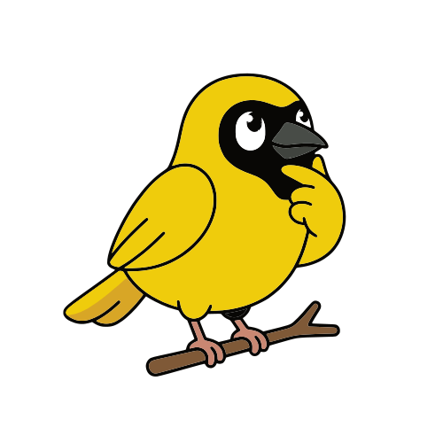

<div align="center">


# Weft

**A new programming language and framework for AI orchestration**

[Try it](#try-it) · [The book](https://weavemindai.github.io/weft/) · [Discord](https://discord.com/invite/FGwNu6mDkU) · [Blog](https://weavemind.ai/blog/future-of-programming)

</div>

---


Running an agent puts one model in charge of the whole job, and you spend time and money waiting for the model to do the task properly. 

In Weft, you break down any task to a graph of scoped nodes. Every node (LLM, agents, human in the loop, API, database, ...) gets exactly the context it needs to run, and the graph takes on the task of coordinating each component properly without any nodes having to spend compute on it.

The compiler checks every connection before the run to make sure your orchestration will run properly, and every value that passes between nodes is recorded in a journal you can watch afterwards.

## Meet Tangle

<table>
<tr>
<td width="25%" valign="top">
  
</td>
<td valign="top">

**You never have to learn this language.** Tangle is our AI assistant: it knows everything about the language and the framework, and guides you every step of the way. Weft was designed from the ground up to be consumed and produced by AI assistants, and guided by humans.

Tangle loads automatically when you open a weft project, and it works with all major assistants: Claude Code, Cline, Codex, Cursor, Devin Desktop, Gemini CLI, GitHub Copilot, Junie, Kilo Code, and OpenCode.

</td>
</tr>
</table>

## Why weft?

- **Readable.** The language describes how components interact, not what happens inside them, so a whole system fits in a few lines of code that are fast to produce and hard to get wrong. The internal representation of the program is natively a graph, so even a non-developer can follow what is happening and fully interact with it through a GUI.
- **Compiled.** The compiler proves things about your orchestration before it runs: today it checks port types, required connections and graph structure; it will grow toward compiler flags that pin down what the system is allowed to do at runtime. The compiler emits a Rust crate around the graph and builds it into a native binary, so you get Rust's memory safety and speed.
- **Alive.** Execution is not one pass through a graph. Parts can stay up, wait for answers, and keep talking to each other while the rest of the program carries on.
- **Durable.** A program can save a wait for a human or an external event, release its worker, and continue when the answer arrives. Every run is written down as it happens, so you can open any of them and see what happened, or is happening, interactively through the graph.
- **Infrastructure included.** Write `pg = PostgresDatabase` and the program gets a Postgres of its own. The node says which container it needs; the runtime starts that container with a disk that survives restarts, and the rest of the program reaches it through one output, `pg.access`. Anything that runs in a container can be an infrastructure node; if you want to write your own, go and read [infrastructure nodes](https://weavemindai.github.io/weft/nodes/infrastructure.html).
- **Dynamic vocabulary.** A node starts with two files: its declaration and its Rust code. The ctx supplies the shared machinery for credentials, storage, signals and execution records. It is opinionated on purpose: there is one way a file is stored and one way a credential is held, and you get every parameter but never the mechanism, so each piece is hardened once instead of half-written again in every node. Your node implements its own job without rebuilding those mechanisms. Where weft's job stops and yours begins is written down in [the commandments of plumbing](https://weavemindai.github.io/weft/thinking/plumbing.html).

## Stop prompting, start writing orchestrations

If you scroll a bit on social media, after a few minutes you should have seen a bunch of AI gurus telling you that "you shouldn’t be prompting agents anymore" and instead be designing loops.

What info is missing is what tool you should use for those loops.

**Today, making one means building everything around it.** An agent framework to
express the loop, a durable engine so a wait survives a restart, an observability
platform to see it, a policy layer to bound it, a canvas you cannot diff. And even then nobody hands you: the API clients, the database, the queue, the
container, the credentials, the form your person actually answers, ... A stack of
products, a pile of glue, and the loop you designed lives in the same messy architecture.

**Weft is one artifact for all of it.** The loop, the API it calls, the database
it writes, the container it needs, the person it asks: each are fast to produce and composable nodes.

## Your first weft program

```weft
whatsapp = BaileyBridge

ask = BaileyReceive { endpointUrl: whatsapp.endpointUrl }

draft = LlmInference -> (answer: String, sensitivity: String) {
  parseJson: true
  prompt: ask.content
  provider: OpenRouterProvider { model: "z-ai/glm-5.3" }.provider
  params: LlmParams { systemPrompt: @file("prompts/support.md"), temperature: 0.75 }.params
}

# Exactly one of these two says yes, the other stays quiet
route = Switch {
  value: draft.sensitivity
  cases: [
    { "kind": "equals", "value": "high", "port": "needsAPerson" },
    { "kind": "otherwise", "port": "goAhead" }
  ]
}

review = HumanQuery {
  _should_flow: route.needsAPerson
  title: "Send this answer?"
  fields: [
    { "kind": "display", "key": "from" },
    { "kind": "display", "key": "question" },
    { "kind": "display", "key": "answer" },
    { "kind": "approve_reject", "key": "send" }
  ]
  from: ask.pushName
  question: ask.content
  answer: draft.answer
}

allowed = FirstInOrder {
  approved: review.send_approved
  automatic: route.goAhead
}

reply = BaileySend {
  _should_flow: allowed.value
  endpointUrl: whatsapp.endpointUrl
  to: ask.chatId
  message: draft.answer
}
```

<div align="center">

<video controls width="100%">
  <source src="docs/src/img/readme_demo.mp4" type="video/mp4">
</video>

https://github.com/user-attachments/assets/3029cd34-25a8-43ec-b396-e3b37cd0be9c

</div>

This is a complete runnable program: a support bot on WhatsApp. A customer messages in, a model writes an answer and rates how sensitive the question was, and if the question is sensitive the program waits for a person to approve the answer before sending it.

The first line is the WhatsApp integration. **It is only one line** because `BaileyBridge` is an infrastructure node: it ships with its own container and manages its own lifecycle. After you start the infrastructure, the bridge shows a QR code in the graph view. Scan it with whatsapp to connect the bridge. You can check the source code of `BaileyBridge` in the [`catalog/`](catalog/bailey/bridge/) if you want to see how it works.


Then `ask` is a trigger: when a message arrives, it starts an execution with the payload. `draft` then calls an LLM and drafts a reply. The system prompt asks for JSON. `parseJson: true` parses the reply, attempts to repair malformed JSON, and pulls out the declared outputs: the answer and the sensitivity rating. The prompt lives in its own file, and the model is pinned in the source, here `z-ai/glm-5.3`.

After that there is a `Switch`. It looks at `draft.sensitivity` and opens exactly one of its two ports: `needsAPerson` if the rating is `"high"`, `goAhead` otherwise. `review` reads that port through `_should_flow`, so the person is only asked when the answer was sensitive.

When the `review` fires, this execution waits for a human to review the answer through the integrated [Weft browser extension](extension-browser/). The question and execution state are saved. Once the worker has no other work, it exits; the waiting execution needs no process of its own. When the human replies, the runtime restores the recorded state and continues. The WhatsApp bridge and shared runtime services stay up. For what survives a restart, read [the journal](https://weavemindai.github.io/weft/running/the-journal.html).

If the user refuses, `send_rejected` fires and `send_approved` closes. That propagates through the rest of the program and stops the execution. If the user approves, `send_approved` fires and `send_rejected` closes. (The two are auto-inferred ports from the field of kind `approve_reject`.)

`FirstInOrder` emits the first of its inputs, in written order, that delivered a value: `review.send_approved` or `route.goAhead`. `reply` uses that as its `_should_flow`.

The whole thing is a runnable project in [`examples/whatsapp-support-bot/`](examples/whatsapp-support-bot/).

## Try it

You need [Docker](https://docs.docker.com/get-docker/),
[kubectl](https://kubernetes.io/docs/tasks/tools/),
[kind](https://kind.sigs.k8s.io/) and [Rust](https://rustup.rs/).
The installer sets up a local Kubernetes cluster, the `weft` command and
the VS Code extension. The extension also installs from the store in VS Code
forks such as Devin Desktop. We are working on a CLI-only version, support for other IDEs and a cloud hosted version. If the extension does not install
automatically, follow the manual instructions the installer prints.

```bash
git clone --branch mvp https://github.com/WeaveMindAI/weft.git
cd weft
./setup.sh
weft new hello --assistant claude-code
cd hello
weft run
```

Open `hello/main.weft` in VS Code to see the program as a graph. Open the
same project in your coding assistant and tell Tangle what you want to build.
Claude Code is the example here; you pick your assistant with `--assistant`, and
weft remembers it for your next project.

If the installer reports a missing tool, it prints where to get it. If your
shell cannot find `weft`, use the PATH line it printed. For installation
options and help, go to [Install](https://weavemindai.github.io/weft/start/install.html).

The installer picks the build for you: an unchanged checkout that matches a published build gets the prebuilt CLI and editor, and anything else is built locally with the reason printed. If it asks for extension build tools, follow [Contributing](CONTRIBUTING.md#set-up).

For human questions and approvals, install **Weft tasks** from
[Firefox Add-ons](https://addons.mozilla.org/en-US/firefox/addon/weft-tasks/) or the
[Chrome Web Store](https://chromewebstore.google.com/detail/weavemind/mddobmalhoelphnmhbenmbmeibfpoppm).

To connect Weft tasks to weft, read the [human-step walkthrough](https://weavemindai.github.io/weft/start/a-person-in-the-loop.html).

## Where to go from here

- **Build something you need.** Give Tangle a whole brief, or ask it for one
  piece at a time. To avoid AI slop, we recommend working against real inputs:
  run a piece, inspect what came out, correct it, then add the next piece.
  Once the whole program works on one example, try another and keep the
  earlier examples passing. Read [Sequential Diffusion Programming](https://weavemindai.github.io/weft/thinking/sdp.html)
  for that process.
- **Try a small program yourself.**
  [Run a greeting and ask Tangle to change it](https://weavemindai.github.io/weft/start/first-program.html).
- **Use an existing example.** The [WhatsApp support bot](examples/whatsapp-support-bot/)
  asks before sending sensitive answers. The [Telegram image bot](examples/telegram-image-bot/)
  takes a credit from a user's balance before drawing a picture.
- **Find a node or write one.** In your project, `weft describe-nodes --list`
  lists the available nodes. If the one you need is missing, start with
  [Writing a node](https://weavemindai.github.io/weft/nodes/your-first-node.html).
- **Bring us an argument or a screenshot of your graph.** Come to
  [Discord](https://discord.com/invite/FGwNu6mDkU). We want to hear what you
  tried and where it fell short. You can also ask tangle to summarize what went wrong during your session and send it to us.

## The vision behind Weft

If you wanted to build a rocket, you wouldn't look for one unbelievably
clever person and tell them to get on with it. You'd put smart people
together, give them tools and resources, and think hard about how they should
work together. Getting AI to work in production deserves the same attention.
A more capable model helps, of course, but we are betting that improving the
thing around it matters just as much.

And there is something fundamental about LLMs that you must keep in mind: what we call “the
AI assistant” isn't the model, even though most people talk as if they are the same
thing. The model predicts probabilities for the next token, then a sampling
algorithm chooses which token actually happens. That token goes back into
the context, the model predicts again, and on it goes. Out of this repeated
prediction and sampling comes the thing you have a conversation with. The AI 
assistant is an emergent phenomenon: the model supplies the possibilities, 
but the conversation takes shape as those possibilities are sampled, and 
[different sampling algorithm get you different behaviors](https://huggingface.co/blog/how-to-generate).

Context and sampling shape everything that emerges from this process, yet we treat
them as a prompt box and a few settings. Our bet is that the next big
breakthrough is waiting there. Give each piece of work a context that fits
it, choose how the model's output steers the rest of the system, and you get
more useful work out of the same model, with more control and fewer tokens
spent getting there.

Let's say for example that you write a weft program to help you find customers. 
It could look like this: A model reads your product and
writes guesses about who buys it. Those guesses go into a search tool like
Apollo, which comes back with companies. Another node scores them and keeps the
best. You filter by company, then another node find the two or three people there worth
talking to. For each one, a node pulls the interesting facts, their role, what
the company just announced, what they write about, and builds a dossier.
Another model reads that dossier and drafts the approach and the email. In the
morning you read the dossier, keep it, tweak it, or rewrite it, and hit send.

Every piece sees only its own slice. The model that guesses personas has never
seen a name. The model that writes the email has never seen the search results,
only the dossier. You write those relationships into the program and this is where
the behavior emerges from. In that sense, **the program is the AI**

Now let's be honest: no serious developer writes code by hand anymore. You
describe what you want, an AI writes it, and you work out whether it
understood you. The way we build software has changed.

The trouble starts when you work on a real production codebase. Your coding assistant has to find
the design buried in the implementation, understand the machinery around it, and
keep enough of both in context to avoid breaking something elsewhere. You have
to rebuild much of that picture to check its work. As the codebase grows, the
picture stops fitting in context, so the assistant writes a second version of
something that already exists, or builds a path around the infrastructure it
was supposed to use. The change works on its own, but it doesn't fit the
program. So you spend more time and tokens getting the AI to get it right.

Weft's bet is that the language should separate those jobs for us:

- **The [plumbing](https://weavemindai.github.io/weft/thinking/plumbing.html) belongs to the language and runtime.** 
  There is less to write, less to load into context, and less to get wrong.
- **The architecture gets its own language.** The graph describes how
  the pieces work together; the processing happens inside the nodes. An
  assistant can read the orchestration without loading every implementation,
  and you can see the design without digging it out of the plumbing.
- **The raw processing is scoped and modular.** A node has defined inputs
  and outputs, so an assistant can implement and test that job on its own.
  A group gives a part of the orchestration its own inputs and outputs too.
  You can delegate a piece of the graph as well as a piece of the processing,
  with a contract for how it fits back into the program.

The compiler helps enforce those boundaries. It checks the connections and
port types before the program runs, giving the assistant errors it can fix
without waiting for you to spot them in review. Later, proving more about how
the orchestration behaves at runtime is part of the ambition of weft.

That is where the speed comes from: the assistant knew where the change
belonged before it started writing.

For the objections I often get and what I think about them, read
[Things people say to me](https://weavemindai.github.io/weft/thinking/objections.html).
For why I am building this rather than something else, read
[How I think about AI safety](https://weavemindai.github.io/weft/thinking/safety.html).

## Where things stand

You can build and run typed graphs with groups, loops, live channels,
infrastructure and waits today. The editor displays execution records,
node inputs and outputs, and live node panels.

The [catalog](catalog/) includes messaging, databases, model providers,
image and audio generation, web search and more. Nodes share the ctx for
connections, files and execution machinery. Cost meters record the calls they
know how to price.

Weft is early, and breaking changes are still possible. This is what we are working on:

- compiler flags to check for policies about what a program may do;
- coordinated assistants building the weft codebase in parallel;
- implementing our own Tangle cli. In a proof-of-concept, our Tangle prototype wrote
  a working program from a brief in under five minutes. The released version is
  slower because existing coding ai spent too much time on fluff that are worthless for weft.
- running outside Kubernetes (a local LLM, or an AWS, GCP or Azure service) and
  connecting it to the rest of the runtime;
- a guide to deploying weft on your cloud provider;
- extending Tangle to write frontend code that plugs into weft;
- letting the program hoster handle multiple user logins for the same program
  natively;

For more detail, read [the roadmap](https://weavemindai.github.io/weft/appendix/roadmap.html).

## Repo layout

| Directory | Start here when you want to… |
|---|---|
| [`catalog/`](catalog/) | Read or change a built-in node |
| [`crates/`](crates/) | Work on the language, compiler or runtime |
| [`packages/weft-graph/`](packages/weft-graph/) | Change the graph editor |
| [`packages/weft-syntax/`](packages/weft-syntax/) | Change shared syntax highlighting |
| [`extension-vscode/`](extension-vscode/) | Work on VS Code integration |
| [`extension-browser/`](extension-browser/) | Work on human forms and notifications |
| [`tangle/`](tangle/) | Change the AI builder's instructions and tools |
| [`examples/`](examples/) | Open a complete program |
| [`docs/`](docs/) | Read or improve the book |
| [`deploy/`](deploy/), [`scripts/`](scripts/) | Work on deployment or test tooling |

## Contributing

Thank you for considering a contribution. For setup, tests and how to send a
change, read [CONTRIBUTING.md](CONTRIBUTING.md).

If the docs get something wrong or leave you confused, please
[let us know](CONTRIBUTING.md#found-something-wrong-in-the-docs).

If you like where Weft is going, you can help fund its development
on [Ko-fi](https://ko-fi.com/quentin101010). Everyone who has helped, with
money or with work, will be added to [THANKS.md](THANKS.md). I will remove this
as soon as we are self-sustainable. If you have experience founding a similar
open source project, please reach out!

## License

Weft uses the [O'Saasy License](LICENSE).

For hosted-use partnerships, write to contact@weavemind.ai.

---

<sub>Weft is built by [WeaveMind](https://weavemind.ai). Come and find us on
[Discord](https://discord.com/invite/FGwNu6mDkU).</sub>
