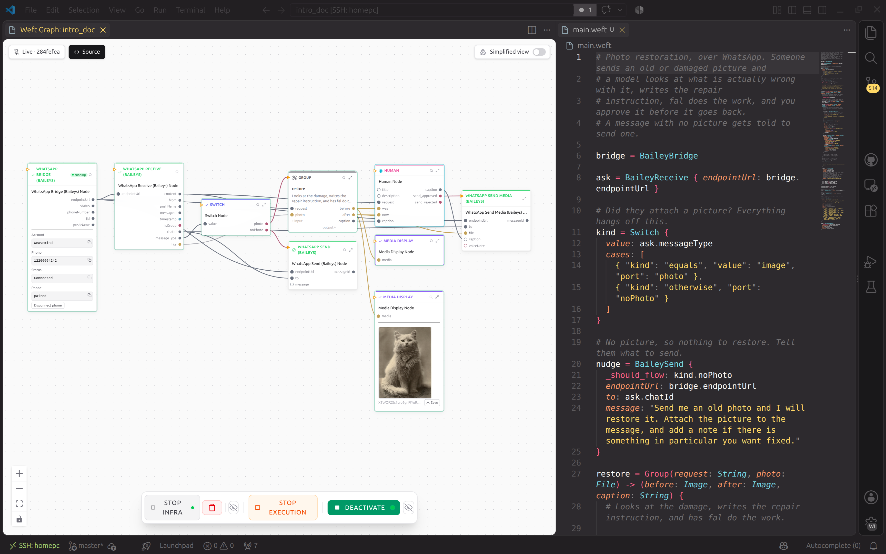

<div align="center">


# Weft

**A programming language and framework for AI orchestration**

*As flexible as an agent, as reliable as code*

[Try it](#try-it) · [The book](https://weavemindai.github.io/weft/) · [Discord](https://discord.com/invite/FGwNu6mDkU) · [Blog](https://weavemind.ai/blog/future-of-programming)

</div>

---



## Why weft?

Weft is a high-level language and a low-level Rust framework made to create complex and reliable orchestrations of AIs, humans and tools:

- **Readable.** The language describes how components interact, not what happens inside them, so a whole system fits in a few lines of code that are fast to produce and hard to get wrong. The internal representation of the program is natively a graph, so even a non-developer can follow what is happening and fully interact with it through a GUI.
- **Compiled.** The compiler proves things about your orchestration before it runs: today it checks port types, required connections and graph structure; it will grow toward compiler flags that pin down what the system is allowed to do at runtime. The compiler emits a Rust crate around the graph and builds it into a native binary, so you get Rust's memory safety and speed.
- **Alive.** Execution is not one pass through a graph. Parts can stay up, wait for answers, and keep talking to each other while the rest of the program carries on.
- **Durable.** A program can save a wait for a human or an external event, release its worker, and continue when the answer arrives. Every run is written down as it happens, so you can open any of them and see what happened, or is happening, interactively through the graph.
- **Infrastructure included.** Write `pg = PostgresDatabase` and the program gets a Postgres of its own. The node says which container it needs; the runtime starts that container with a disk that survives restarts, and the rest of the program reaches it through one output, `pg.access`. Anything that runs in a container can be an infrastructure node; if you want to write your own, go and read [infrastructure nodes](https://weavemindai.github.io/weft/nodes/infrastructure.html).
- **Dynamic vocabulary.** A node starts with two files: its declaration and its Rust code. The ctx supplies the shared machinery for credentials, storage, signals and execution records. It is opinionated on purpose: there is one way a file is stored and one way a credential is held, and you get every parameter but never the mechanism, so each piece is hardened once instead of half-written again in every node. Your node implements its own job without rebuilding those mechanisms. Where weft's job stops and yours begins is written down in [the commandments of plumbing](https://weavemindai.github.io/weft/thinking/plumbing.html).
- **Built by talking.** The AI assistant that writes weft with you is part of the language: `weft new hello --assistant claude-code` (other assistants are available) installs Tangle; opening the project in your coding assistant then loads it automatically. Tangle gives your coding assistant the language and catalog, builds one stage at a time, runs it, reads the journal, and writes the nodes that are missing.

## Your first weft program

Before the code, one thing: **you never have to learn this language.** A new project installs Tangle, the AI builder, which writes and runs the program
while you say what you want in plain words. Your job is the part you are already good at: saying what the system should do, and what feels wrong.

```weft
whatsapp = BaileyBridge

ask = BaileyReceive { endpointUrl: whatsapp.endpointUrl }

draft = LlmInference -> (answer: String, sensitivity: String) {
  parseJson: true
  prompt: ask.content
  provider: OpenRouterProvider { model: "z-ai/glm-5.3" }.provider
  params: LlmParams { systemPrompt: @file("prompts/support.md"), temperature: 0.75 }.params
}

# Exactly one of these two says yes, the other stays quiet
route = Switch {
  value: draft.sensitivity
  cases: [
    { "kind": "equals", "value": "high", "port": "needsAPerson" },
    { "kind": "otherwise", "port": "goAhead" }
  ]
}

review = HumanQuery {
  _should_flow: route.needsAPerson
  title: "Send this answer?"
  fields: [
    { "kind": "display", "key": "from" },
    { "kind": "display", "key": "question" },
    { "kind": "display", "key": "answer" },
    { "kind": "approve_reject", "key": "send" }
  ]
  from: ask.pushName
  question: ask.content
  answer: draft.answer
}

allowed = FirstInOrder {
  approved: review.send_approved
  automatic: route.goAhead
}

reply = BaileySend {
  _should_flow: allowed.value
  endpointUrl: whatsapp.endpointUrl
  to: ask.chatId
  message: draft.answer
}
```

<div align="center">

<video controls width="100%">
  <source src="docs/src/img/readme_demo.mp4" type="video/mp4">
</video>

https://github.com/user-attachments/assets/3029cd34-25a8-43ec-b396-e3b37cd0be9c

</div>

This is a complete runnable program: a support bot on WhatsApp. A customer messages in, a model writes an answer and rates how sensitive the question was, and if the question is sensitive the program waits for a person to approve the answer before sending it.

It is about forty lines, so let me walk you through it:

The first line is the WhatsApp integration. **It is only one line** because `BaileyBridge` is an infrastructure node: it ships with its own container and manages its own infrastructure. After you start its infrastructure, the bridge shows a QR code in the graph view. Scan it with the phone that owns the WhatsApp account to connect the bridge. You can check the source code of `BaileyBridge` in the [`catalog/`](catalog/bailey/bridge/) if you want to see how it works.

Then `ask` is a trigger that waits for a message to come in. When a message arrives, `ask` starts an execution with its payload. Then `draft` calls an LLM and drafts a reply. The system prompt asks for JSON. `parseJson: true` parses the reply, attempts to repair malformed JSON, and extracts the declared outputs: the answer, and the sensitivity rating. The system prompt lives in its own file, and the model is pinned in the source, here `z-ai/glm-5.3`.

After that there is a `Switch`. It looks at `draft.sensitivity` and opens exactly one of its two ports: `needsAPerson` if the rating is `"high"`, `goAhead` otherwise. `review` reads that port through `_should_flow`, so the person is only asked when the answer was sensitive; if not, the review node is skipped.

When the `review` fires, this execution waits for a human to review the answer through the integrated [Weft browser extension](extension-browser/). The question and execution state are saved. Once the worker has no other work, it exits; the approval needs no process of its own while it waits. When the human replies, the runtime restores the recorded state and continues. The WhatsApp bridge and shared runtime services stay up. For what survives a restart, read [the journal](https://weavemindai.github.io/weft/running/the-journal.html).

If the user refuses, `send_rejected` fires and `send_approved` closes. That propagates through the rest of the program and stops the execution. If the user approves, `send_approved` fires and `send_rejected` closes. (The two are auto-inferred ports from the field of kind `approve_reject`.)

Then `FirstInOrder` takes the first of its inputs, in written order, that delivered a value, `review.send_approved` or `route.goAhead`, and outputs it as `.value`, and `reply` uses it as its own `_should_flow`. In this program the two branches are mutually exclusive, so only one can deliver an approval. So either the LLM decided it wasn't highly sensitive and it skipped directly to this node and then sent the reply, or the human approved the reply and it gets sent through the same path.

The whole thing is a runnable project in [`examples/`](examples/whatsapp-support-bot/). There are other, more complex examples next to it.

## Try it

You need [Docker](https://docs.docker.com/get-docker/),
[kubectl](https://kubernetes.io/docs/tasks/tools/),
[kind](https://kind.sigs.k8s.io/) and [Rust](https://rustup.rs/).
The installer sets up a local Kubernetes cluster, the `weft` command and
the VS Code extension (you should be able to install the vscode extension through the store in other vscode forks like devin desktop and similar too. We are working on a cli only version, supporting other code ide and an cloud hosted version soon). If it cannot install the extension automatically, follow the manual installation instructions it prints.

```bash
git clone --branch mvp https://github.com/WeaveMindAI/weft.git
cd weft
./setup.sh
weft new hello --assistant claude-code
cd hello
weft run
```

Open `hello/main.weft` in VS Code to see the program as a graph. Open the
same project in your coding assistant and tell Tangle what you want to build.
Claude Code is the example here; the assistant choice belongs to the
`--assistant` flag and is remembered for your next project.

If the installer reports a missing tool, it prints where to get it. If your
shell cannot find `weft`, use the PATH line it printed. For installation
options and help, go to [Install](https://weavemindai.github.io/weft/start/install.html).
An unchanged checkout matching a published build can use downloaded artifacts;
for a checkout that needs a source build, follow [Contributing](CONTRIBUTING.md#set-up).

For human questions and approvals, install **Weft tasks** from
[Firefox Add-ons](https://addons.mozilla.org/en-US/firefox/addon/weft-tasks/) or the
[Chrome Web Store](https://chromewebstore.google.com/detail/weavemind/mddobmalhoelphnmhbenmbmeibfpoppm).

Go check the [human-step walkthrough](https://weavemindai.github.io/weft/start/a-person-in-the-loop.html) to connect it to weft.

## Where to go from here

- **Build something you need.** Give Tangle a whole brief, or ask it for one
  piece at a time. To avoid AI slop, we recommend working against real inputs:
  run a piece, inspect what came out, correct it, then add the next piece.
  Once the whole program works on one example, try another and keep the
  earlier examples passing. Read [Sequential Diffusion Programming](https://weavemindai.github.io/weft/thinking/sdp.html)
  for that process.
- **Try a small program yourself.**
  [Run a greeting and ask Tangle to change it](https://weavemindai.github.io/weft/start/first-program.html).
- **Use an existing example.** The [WhatsApp support bot](examples/whatsapp-support-bot/)
  asks before sending sensitive answers. The [Telegram image bot](examples/telegram-image-bot/)
  takes a credit from a user's balance before drawing a picture.
- **Find a node or write one.** In your project, `weft describe-nodes --list`
  lists the available nodes. If the one you need is missing, start with
  [Writing a node](https://weavemindai.github.io/weft/nodes/your-first-node.html).
- **Bring us a question or an argument.** Come to [Discord](https://discord.com/invite/FGwNu6mDkU).
  We want to hear what you tried and where it fell short.

## The vision behind Weft

If you wanted to build a rocket, you probably wouldn't put all your effort
into finding one unbelievably clever person and telling them to get on with
it. You'd put smart people together, give them tools, ressources, and think hard about
how they should work together. We think getting AI to work in
production deserves that same attention. A more capable model helps, of
course, but we are betting that improving the thing around it matters just as much.

And there is something fundamental about LLMs that you must keep in mind: what we call “the
AI assistant” isn't the model, even though most people talk as if they are the same
thing. The model predicts probabilities for the next token, then a sampling
algorithm chooses which token actually happens. That token goes back into
the context, the model predicts again, and on it goes. Out of this repeated
prediction and sampling comes the thing you have a conversation with. The AI 
assistant is an emergent phenomenon: the model supplies the possibilities, 
but the conversation takes shape as those possibilities are sampled, and 
[different sampling algorithm get you different behaviors](https://huggingface.co/blog/how-to-generate).

Context and sampling have a say in everything that emerges from this process, yet it's easy to
treat them as a prompt box and a few settings you fiddle with. Our bet is
that the next big breakthrough is waiting here. Give each piece of work a
context that actually fits it, choose how the model output steer the whole system, and
we think you can get more useful work out of the same model, with more
control over what it does and fewer tokens spent getting there.

You can have an agent investigate a customer's problem, let another check its
answer, and bring in a person before anything gets sent. The investigator
has room to investigate; it doesn't also get to decide whether its own work
needs approval. You write those relationships into the program. The AI your
customer encounters is the behavior that comes out of all of it working
together. In that sense, **the program is the AI**.

Now let's be honest, no serious developer writes code anymore: you describe
what you want, an AI writes it, and you work out whether it understood you.
The way we build software has changed.

To change how a program behaves, your coding asssitant has to find the design buried in the implementation, understand the
machinery around it, and keep enough of both in context to avoid breaking
something elsewhere. You have to reconstruct much of the same picture to
check its work.

And you probably know the pain: As the codebase grows, more of that picture stops fitting in context. The
assistant writes a second version of something that already exists, or
builds a path around the infrastructure it was supposed to use. The change
works on its own, but it doesn't fit the program. So you spend more time, tokens and money getting the AI to review
its own work until the change actually belongs in the codebase.

Weft's bet is that the language should separate those jobs for us:

- **The [plumbing](https://weavemindai.github.io/weft/thinking/plumbing.html) belongs to the language and runtime.** 
  There is less to write, less to load into context, and less to get wrong.
- **The architecture gets its own language.** The graph describes how
  the pieces work together; the processing happens inside the nodes. An
  assistant can read the orchestration without loading every implementation,
  and you can see the design without digging it out of the plumbing.
- **The raw processing is scopped and modular.** A node has defined inputs
  and outputs, so an assistant can implement and test that job on its own.
  A group gives a part of the orchestration its own inputs and outputs too.
  You can delegate a piece of the graph as well as a piece of the processing,
  with a contract for how it fits back into the program.

The compiler helps enforce those boundaries. It checks the connections and
port types before the program runs, giving the assistant errors it can fix
without waiting for you to spot them in review. Later, proving more about how the
orchestration will behave at runtime is part of the ambition of weft.

That's where the coding speed and performance comes from: spending less time getting
a change to fit, because the assistant knew where it belonged before it
started writing.

For the objection I often get and what I think about them, read
[Things people say to me](https://weavemindai.github.io/weft/thinking/objections.html).
And if you want to know why I am building this rather than something else,
that reasoning is in
[How I think about AI safety](https://weavemindai.github.io/weft/thinking/safety.html).

## Where things stand

You can build and run typed graphs with groups, loops, live channels,
infrastructure and human waits today. The editor displays execution records,
node inputs and outputs, and live node panels. Tangle supplies your coding
assistant with the language, catalog and tools to build programs and new nodes.

The [catalog](catalog/) includes messaging, databases, model providers,
image and audio generation, web search and more. Nodes share the ctx for
connections, files and execution machinery. Cost meters record supported
calls; an unknown cost is shown as unknown.

Weft is early and breaking changes are still possible. The following is what we are working on:

- compiler flags that check policies about what a program may do;
- coordinated assistants building in parallel the weft codebase;
- implementing our own tangle: There is a lot of opportunity for speedup that is unfortunately not done by most coding assistant. In the POC we demonstrated an AI that was able to code complex programs in under 5min, but we didn't have the time to port it to the release version yet. This is one of the top priority and should allow a much higher bandwidth between the ai builder and the human.
- running stuff outside of kubernetes (e.g. a local llm inference, or even a aws/gcp/azure service) and get it to connect properly to the rest of the runtime
- a guide to deploy weft on your respective cloud providers
- extending tangle to be able to code frontend that plugs properly with weft
- allow the program hoster to handle multiple user login for the same program natively
- we are considering adding real function calling, but for now this is defered because it would change quite a lot of things on the data flow and can be emulated with includes.

For more detail, read [the roadmap](https://weavemindai.github.io/weft/appendix/roadmap.html).

## Repo layout

| Directory | Start here when you want to… |
|---|---|
| [`catalog/`](catalog/) | Read or change a built-in node |
| [`crates/`](crates/) | Work on the language, compiler or runtime |
| [`packages/weft-graph/`](packages/weft-graph/) | Change the graph editor |
| [`packages/weft-syntax/`](packages/weft-syntax/) | Change shared syntax highlighting |
| [`extension-vscode/`](extension-vscode/) | Work on VS Code integration |
| [`extension-browser/`](extension-browser/) | Work on human forms and notifications |
| [`tangle/`](tangle/) | Change the AI builder's instructions and tools |
| [`examples/`](examples/) | Open a complete program |
| [`docs/`](docs/) | Read or improve the book |
| [`deploy/`](deploy/), [`scripts/`](scripts/) | Work on deployment or test tooling |

## Contributing

Thank you for considering a contribution. For setup, tests and how to send a
change, read [CONTRIBUTING.md](CONTRIBUTING.md).

If the docs get something wrong or leave you confused, please
[let us know](CONTRIBUTING.md#found-something-wrong-in-the-docs).

If you like where Weft is going, you can help fund its development
on [Ko-fi](https://ko-fi.com/quentin101010). Everyone who has helped, with
money or with work, will be added to [THANKS.md](THANKS.md). I will remove this 
as soon as we are self sustainable, if you have experience with similar open source
project foundings please reach out to us.

## License

Weft uses the [O'Saasy License](LICENSE). 

For hosted-use partnerships, contact contact@weavemind.ai.

---

<sub>Weft is built by [WeaveMind](https://weavemind.ai). Come and find us on
[Discord](https://discord.com/invite/FGwNu6mDkU).</sub>
