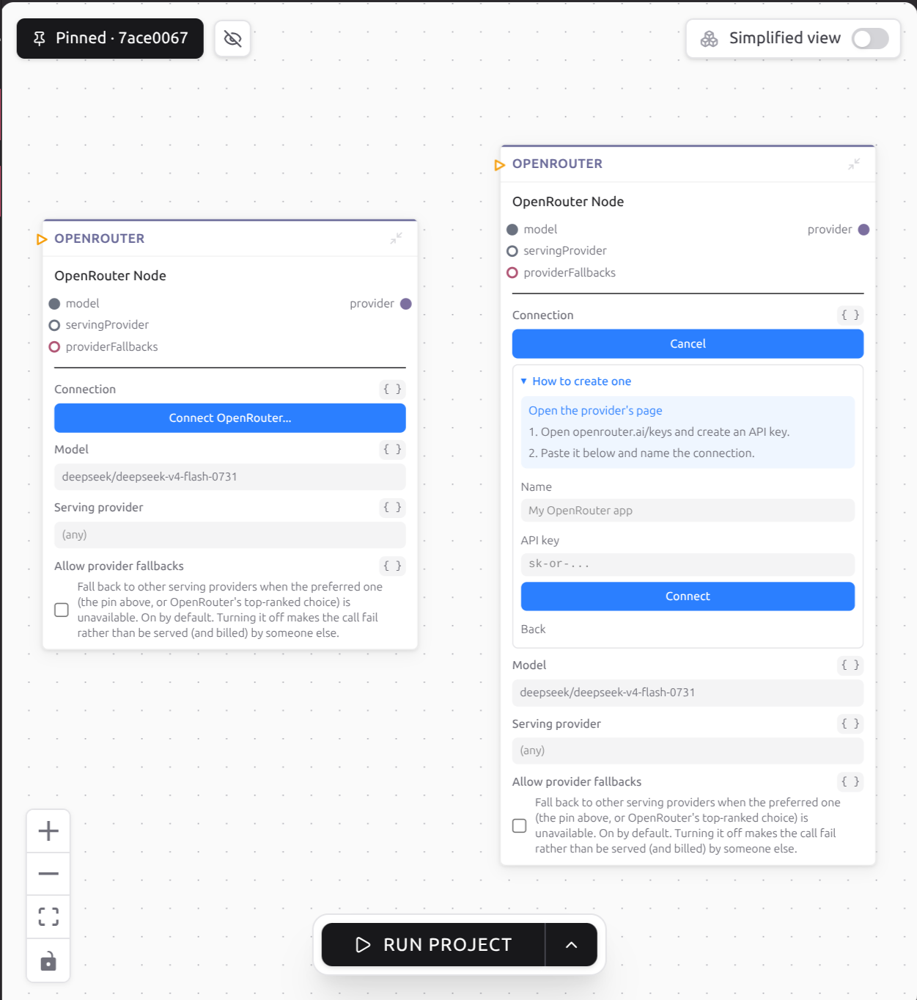

# Connecting an account

A step that sends a Slack message needs a Slack account. You connect it once,
weft keeps the credential, and your program passes around a reference to it
rather than the secret itself.

## Do it in the graph

A step that talks to an outside service has a blue **Connect Slack...** button
in its body, named after whatever service it needs. Until you pick something,
that step will not fold shut: where the fold arrow normally sits it says
**Pick a connection first**.

Click it and you get your existing connections for that service, then, under
**+ Add a connection**, the ways to make a new one:

- **Use *App name* (one click)**, one row per application your runtime was
  configured with, each showing the permissions it asks for. Those permissions
  are fixed per application, so you pick an application rather than ticking
  boxes.
- **Use ours (uses your credits)**, when the runtime holds a key for that
  service. This is the row that appears because you filled in
  [`access-apps.json`](../connections/the-apps-file.md) before installing.
- **Your own...**, always. Tick the permissions you want, follow the guide for
  registering an application with that provider, or just paste a key you
  already have.

Sign-in opens your browser for the provider's consent screen and the panel
waits, then flips to a green **Connected as *your name*** with **Change** and
**Disconnect** beside it.



If you take the shared door, weft warns you once that somebody else in the same
workspace using that same application may disconnect you, and that your own
application avoids it.

## Or from the terminal

```bash
weft connect
```

Run it in the project folder, pick the step, and answer the prompts. `weft
connect --list` prints what is already stored and changes nothing. `weft
connect --node account` goes straight to one step. `--disconnect` clears a
step's choice and leaves the stored account alone, and `--forget <id>` deletes
the stored account for good.

## Never paste a key into a step's field

Values written into a step travel through the journal and render in the
inspector as plain text, where anybody who can open the project reads them.
That is also true of anything you paste into a chat with your assistant.

A connection is the other thing: the secret goes into weft's own store, and
what moves along the wire is a small reference with no secret in it.

```json
{
  "__weft_access__": {
    "accessId": "connection-id",
    "service": "slack",
    "identity": "Acme Corp",
    "requiresPermissions": ["chat:write"],
    "requiresValues": []
  }
}
```

Every step that consumes it stamps on what it needs, and a connection that
falls short is refused when the step opens it rather than failing halfway
through a call.

## What weft can tell you before a call fails

Providers differ in how honest they are. Some state exactly what they granted,
and weft blocks a step whose permission is missing. Others only confirm the
credential is alive, or say nothing at all until a real call comes back
refused, and then weft lets the call through because it has nothing to block
on.

So a bad credential sometimes shows up for the first time when a step tries to
use it. For the whole picture, go and read
[how connections work](../connections/how-they-work.md).

Next, [put a person in the loop](a-person-in-the-loop.md).
