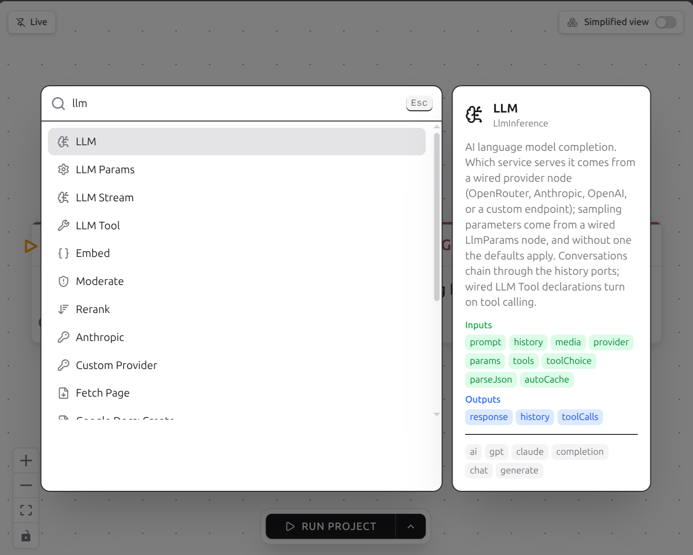
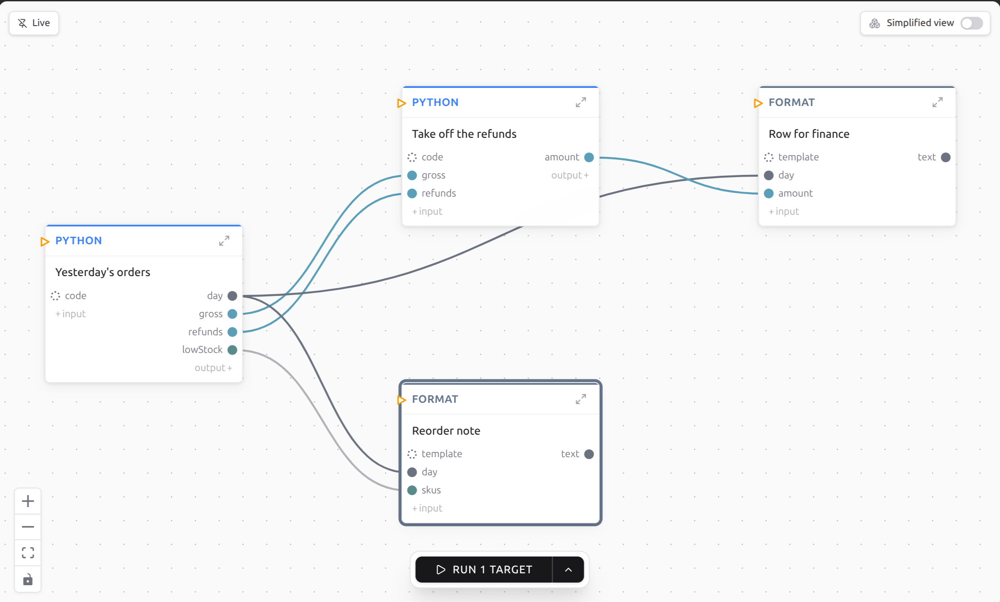

# Working in the graph

Everything here works with the mouse, and every gesture rewrites your `.weft`
file. The two panes are one file, so nothing you do on the canvas is stored in
a second place that could disagree with your source.

## Getting around

Scroll to move around. Drag empty canvas to move around faster. Zoom is the
`+` and `-` buttons at the bottom left, with **Fit View** beside them for when
you drag something into the distance and lose it. Scrolling does not zoom, on
purpose, so a stray trackpad gesture cannot throw your whole graph off screen.

Hold **Shift** and drag to select several boxes at once.

## Add a step

Press **Ctrl+P** (**Cmd+P** on a Mac) and search. Right-clicking empty canvas
and picking **Add Node...** opens the same list.



The list holds every step your project knows about, and `Group` and `Loop` are
in there with the rest, because a group is a kind of step.

It also holds the plain actions, so you can find them without remembering a
chord: Undo, Redo, Duplicate Selected, Delete Selected, Select All Nodes, Fit
View, and Auto Organize Layout, which tidies the whole canvas.

If you already know what should come next, drag out of a dot and let go over
empty canvas. The list opens, and the step you pick arrives with the arrow
already drawn. One **Ctrl+Z** takes away both.

## Connect two steps

Drag from a dot on one box's right edge to a dot on another box's left edge.
The line takes the colour of the dot it started from.

Three things will refuse the drop, and each tells you which:

- **The types do not fit.** Same colour is the quick check. The full rules are
  in [Types](../language/types.md).
- **The two boxes are in different groups.** A value crossing that line has to
  go through the group's own dots. That is what a group is for.
- **The input already has a value written into it.** You get
  `'<port>' is driven by a config assignment; unset it first to drive it with an edge.`
  Clear the field, then draw the arrow.

To remove an arrow, grab it near one end and drop it on empty canvas.

To take one field out of a value instead of the whole thing, right-click the
arrow. You get the keys inside it with their types, and clicking one narrows
the arrow to that key. **Up one level** goes back and **Read the whole value**
undoes it.

## Change what a step does

The small arrow in a box's header opens its body, where its fields are: text
boxes, dropdowns, tickboxes, code editors, file pickers. A field fed by an
arrow hides itself, because the arrow is now the source of that value.

Under the inputs there is a **+ input** button, and **+ output** under the
outputs. A port you add starts with the type `MustOverride`, which is weft
saying nobody has decided this yet, and the build stops until you do.
Right-click the new dot and pick the **Type:** row to set it.

That same right-click menu makes an input required or optional, removes it, or
puts a catalog port back the way it was.

Double-click a box's name to rename it. Right-click a box for **Duplicate**,
**Delete**, **Tags…**, **Set as target** and **Run from here…**.

## Run one branch instead of everything

Right-click the box whose answer you want and choose **Set as target**. It gets
a breathing ring, and the Run button becomes **Run 1 target**. Only that box
and the boxes feeding it will run. Set as many as you like; right-clicking a
target again offers **Unset target**.



The same thing from a terminal:

```bash
weft run --target daily_report
```

The walk stops when it reaches a trigger, and a box that two branches share
does not drag the other branch in. A target inside a group brings only the work
needed through it. A loop is the exception and comes along whole.

For anything more specific, the chevron glued to the Run button opens
**Run from a spec…**, a dialog where you can start partway in with values you
supply, exclude an endpoint, run one group on its own, fire a single trigger
with a made-up event, or reuse what did not change since the last run. Right-clicking a box and
choosing **Run from here…** opens the same dialog already filled in.
Everything in there has a flag on [the CLI](../running/cli.md), and the rules
are in [versions, seeds and frozen examples](../running/versions.md).

## Watch it go

**Run Project** is at the bottom of the canvas, or press **Ctrl+Enter** with
the graph focused. While a run is going, that button becomes **Stop
Execution**.

Each box gets a glow and a small mark:

| The box | What happened |
|---|---|
| Amber glow, `●` | Running now |
| Cyan glow, `◉` | Waiting for an answer from outside |
| Green glow, `✓` | Finished |
| Red glow, `✕` | Failed |
| Grey `■` | You stopped it |
| Grey `⊘` | Skipped |
| Purple glow | Reused from an earlier run instead of run again |
| Dimmed, no glow | Outside the part of the graph this run covered |

Click the magnifying glass in a box's header, **Inspect execution**, for what
went in, what came out, how long it took and what it cost. A failed box shows
its error there. A skipped box says why in words, such as
`its _should_flow said no` or `the required input 'x' closed`, and you follow
the arrows backwards from there to find the step that decided.


A box that ran several times, which happens inside a loop, gets a `‹ 2/5 ›` in
its header to step through the firings.

## Look at an older run

The toggle at the top left decides which run the graph shows. Hover any of
its three parts to see what it does:

- **Following** puts every run that starts on the graph. It is the default,
  and clicking **Run** in the editor always comes back to it.
- **Locked** keeps the graph on the run it shows, so you can read it while
  others start.
- **Off** takes the run away and leaves just the program.

While locked or off, runs that start are counted in a button beside the
toggle, like **2 new runs · Follow**, and clicking it shows the newest and
follows again. A run started from a terminal, yours or an assistant's, never
changes the mode. Each project remembers whether you left it following.

For a run from yesterday, click the **Weft** icon in the side strip.
**Executions** lists every run of the project you last opened, newest first,
and each row has **View in Graph**, which puts that run back on the canvas with
its values in place and locks the toggle onto it. A replayed run looks exactly
like a live one.

## Fold a big program down

Every group has **Collapse group** in its header, and **Expand group** when it
is shut. The wiring outside does not change either way.


To make a group, add a `Group` step and drag boxes into it. weft decides where
a box landed from its centre, so drag it until its middle is inside. To undo
that, delete the group: every box inside climbs out one level and keeps its
position.

Moving a box in or out of a group changes your program, because it changes what
that box can reach. Dragging a box anywhere else does not: positions live in
`layouts/`, beside your source, not in it.

To show your program to somebody, there is a **Simplified view** switch at the
top right. Every box becomes a plain square with one dot on each side. You can
still move boxes and fold groups, and you cannot wire anything, which is the
point.

Next, [connect an account](connections.md).
