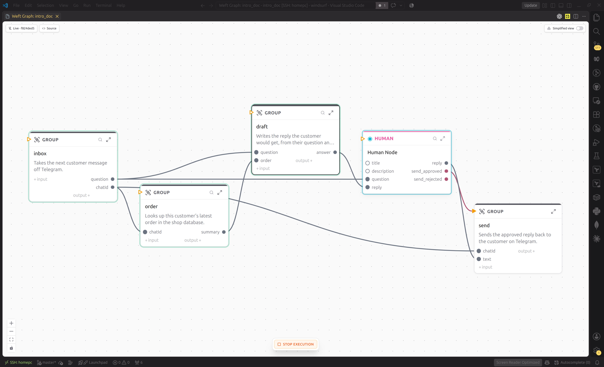

# Introduction

Weft is a high-level language and a low-level Rust framework made to create complex and reliable orchestrations of AIs, humans and tools.

Weft installs in code ide (for now vscode and its forks are supported, more coming soon) and integrate prompts for all major coding assistants. It is also fully interactive through cli and code if you do not want a code ide (you will not have the graphical interface)



## Getting started

First, [install weft](start/install.md). The installer runs a small Kubernetes cluster on your machine, and sets up the `weft` CLI and the VS Code extension.

Then [build your first program](start/first-program.md).

The rest of the book is for when you want to know how weft works underneath, or you want to write a piece of weft yourself.

If you find a mistake, or an explanation you cannot follow, [tell us](https://github.com/WeaveMindAI/weft/blob/mvp/CONTRIBUTING.md#found-something-wrong-in-the-docs).

## You do not have to read this book

If you pass `--assistant` when you create a project, weft installs Tangle our in house weft specialist:

```
weft new hello --assistant claude-code
```

Other assistants are available too, and the flag is remembered for your next project.

Tangle knows the language and the framework, and it has the tools for running and debugging. You can tell it what you want in plain words and it will handle everything for you.