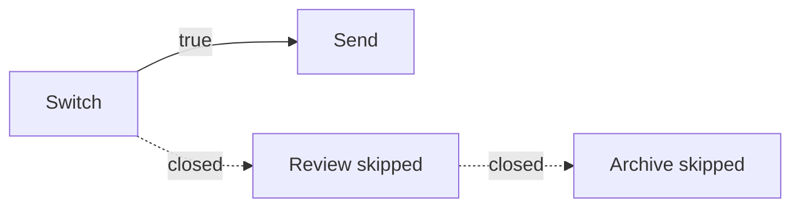

# How a program runs

Do not read a weft program top to bottom. A step can send its answer before it
has finished, or sit waiting for a week while the rest of the program carries
on. If you want to predict what happens, look at what arrives at each step's
inputs.

## Values arrive one at a time

When a step emits, the value travels along every arrow leaving that output.
Each delivery is a **pulse**, aimed at one input, carrying a tag saying which
run it belongs to. One output wired to three inputs is three deliveries.

A step waits until every input with an arrow into it has either a value or a
closure. Optional inputs count too: an arrow is an arrow. An input can also be
satisfied by a value written into the step or by a default, so not everything
needs an arrow.

Once every wired input has settled, weft decides whether the step runs or is
skipped. A step with nothing wired into it has nothing to wait for, so weft
starts it when the run begins.

## How a branch stops the steps after it

Here is the problem. A step decided not to send anything. Everything wired to
it is now waiting for a value that is never coming. How does the program know
the difference between "not yet" and "never"?

A **closure** is the answer: it is a pulse that says nothing will ever arrive
here, for this run. It is how a step says no rather than saying nothing.

It is not `null`. `null` is a value, and a port whose type allows it takes it
like any other.

For an ordinary step:

| What happened | What the step does |
|---|---|
| A required input closed | Skips |
| An optional input closed | Nothing. The other inputs decide |
| Every input closed | Skips |
| Every `@require_one_of` input closed | Skips |
| `_should_flow` is `false`, or closed | Skips |

A skipped step closes its own outputs, which can skip the next step, and the
next, until the closures reach something that can carry on with what it has.



Streams close differently. A closure on a stream is the stream's end rather
than a skip, so a reader whose stream carried nothing still runs and sees that
nothing came.

A failed step closes whatever it had not already sent. Anything it did send is
not taken back.

## Choosing a branch, and joining back up

Every step has `_should_flow`, and it defaults to true. Wire a value into it to
decide whether that step runs.

Only a literal `false` says no. Any other value lets the step run, and so does
anything the step's own code would have considered falsy. The step never sees
this port: weft checks it before calling in.

`Switch` gives you one output per case. It tries them in the order you wrote
them, and the first one that matches emits `true` while every other one closes.
Wire a case's output into a step's `_should_flow` and that step runs on that
case only. If nothing matches and you gave no `otherwise`, they all close.

To bring two alternative answers back into one arrow, use `FirstInOrder`. It
waits for its wired inputs to settle, then takes the first one that actually
supplied a value, **in written order**. Moving those lines changes which answer
wins. Which one arrived first makes no difference.

`_should_flow` takes one wire, so "only if the model said it was rude *and*
said it was sure" is one gate fed by two conditions. `All` is the AND: wire
both conditions into it and gate on what it emits. It emits when every input
arrived and none of them is `false`, and a branch that closed never arrives at
all, so a closed input is not a `false`.

### Running on the thing that did not happen

Everything above skips when its inputs close. So how do you run a step
*because* something did not arrive?

Wire that something into `_should_not_flow` instead. Every answer flips: a
value arriving means the step stays off, and a closure, the structural "nothing
is coming", is what runs it.

```weft
route = Route -> (photo: File) { path: "cards", method: "POST" }

# A card sent with no picture: `photo` closes, so this runs.
default_art = FetchToStorage { url: "https://example.com/blank.png" }
default_art._should_not_flow = route.photo
```

This is the one port in weft that starts a step on a closure. Reach for it when
the absence is **data**, like a key the caller did not send. When the absence
is a **decision your own step made**, have that step say so on a second output
and gate on that, because the wire then reads forwards.

A step has one gate. Wiring both spellings is the `two-gates` error.

## One step, several runs at once

A **firing** is one go at one step. Three things say which firing you are
looking at: the run, the step, and the loop iterations it sits inside. Inside a
parallel loop the same step can have several firings alive at the same time.

Those iteration numbers are called **frames**. Work at the top level has none,
and work inside two nested loops carries one frame for each. weft only ever
combines inputs whose run and frames match, which is what stops iteration three
eating iteration four's answer.

An ordinary output emits at most once per firing, though it can emit on one
output now and another later. Whatever it never mentions is closed when it
finishes. Generators and buses have their own rules, in
[streams and buses](streams-and-buses.md).

## Groups and loops are gone before anything runs

The compiler turns each group into a pair of boundary steps, each loop into a
`LoopIn` and a `LoopOut`, and each included file into a call pair plus one
shared body. What the runtime gets is one flat graph with the scope information
attached.

So folding a group in the editor costs nothing at run time, and neither does
nesting groups five deep. For the boundary rules, go and read
[groups](groups.md) and [loops](loops.md).

## What happens when you hit run

A **manual run** starts every step at the top level that has nothing wired into
it, plus every trigger in the project, wired or not. Triggers get no event on a
run like that, so they close their outputs, and only the paths that do not need
an event go anywhere.

To run part of a project:

```bash
weft run --target daily_report --target alert
```

weft takes those steps and everything feeding into them, stopping the walk when
it reaches a trigger. A step that several branches share does not drag those
other branches in. A target inside a group brings only the work needed through
it, with the group's own `_should_flow` still applied. A loop is the exception:
it comes along whole, and cutting inside one is refused.

You can also start in the middle, handing values in where the walk begins:

```bash
weft run --from classify='{"text":"..."}' --target reply
weft run --group triage='{"text":"..."}'
```

A value a real execution produced beats one you handed in, and a producer that
is still running is waited for. For which flag picks which part of the graph,
go and read [versions, seeds and frozen examples](../running/versions.md).

A **trigger firing** picks the work downstream of that trigger, plus whatever
that work needs upstream, again stopping at other triggers. Only the trigger
that fired gets the event; any others close. Two triggers can share the steps
in the middle without becoming one run.

## How a run ends

A run is finished when there is no work left and nothing still in flight. It
does not need an end step. It can also fail, when a step failed or weft could
get no further, or be cancelled by a person or by another run.

A run can pause without ending. **Waiting for input** means a step is parked
on an answer from outside, and the run carries on when that answer comes.

If work is left that can never proceed, weft reports the run as **stuck** and
names the steps and inputs involved. A run parked on a person's answer is
waiting, not stuck.

## What survives a restart

As a run goes, the worker writes down each thing that happened, in a log called
the journal. Those records are what the graph shows you, and they are what a
replacement worker reads to rebuild a run that was interrupted. A step whose
completion was safely written down does not run again.

A step whose completion was not written down runs again from the top. `ctx.run`
gives back a saved result rather than redoing the work, but an external action
can still happen twice if the worker died before the result was recorded. Go
and read [surviving a restart](../nodes/durable-execution.md) before you put
side effects around a wait.

## What the build catches

The compiler checks that every arrow's types fit, that every required input is
covered, that no wire crosses a scope boundary it should not, that there are no
cycles, and that the loop and channel restrictions hold. It also runs whatever
validation rules a step declares for itself.

Some things are checked when you build and some only when you run, so a build
can succeed and a value can still be rejected later, when a step emits
something its declared output type does not allow.

It cannot check whether a step does useful work. A model can return a perfectly
typed answer that is wrong. For every rejection by name, go and read
[what the compiler refuses](diagnostics.md). To start writing weft yourself,
carry on to [syntax](syntax.md).
