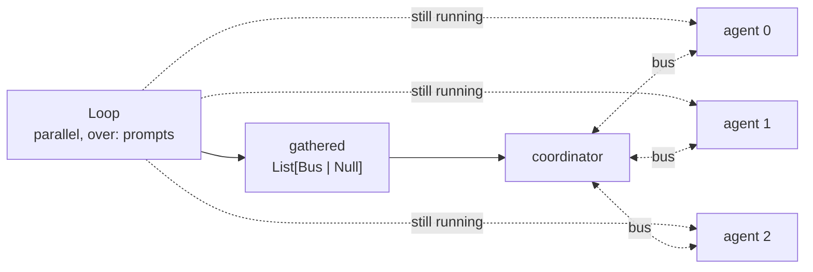

# Loops

`Loop` is a built-in like `Group`, but its body runs many times: once per
element of a list, once per item of a stream, or until the body votes to stop.

```weft
doubler = Loop(values: List[Number]) -> (results: List[Number | Null]) {
  parallel: false
  over: ["values"]

  step = ExecPython(n: Number) -> (out: Number) {
    code: "return {'out': n * 2}"
  }
  step.n = self.values
  self.results = step.out
}

doubler.values = nums.values
```

Note the types on the boundary. Outside, `values` is a `List[Number]`. Inside,
`self.values` is one `Number`. The loop unwraps on the way in and gathers on
the way out.

## The four port roles

Every port on a loop is in exactly one of four roles, derived from the
config.

### 1. Iter input, named in `over`

Outside `List[T]`, inside `T`. The body sees one element per iteration.

Several ports in `over` zip together in lockstep. When their lists are different
lengths at run time they are zipped to the shortest, unless you set
`trim_on_mismatch: false`, which fails the loop loudly instead.

### 2. Carry port, named in `carry`

Declared on the **output** side of the signature. The compiler auto-creates a
matching input port with the same name and type for the initial value.

This is the accumulator. Reading `self.<port>` gives the previous iteration's
value, or the initial one on the first pass; writing it sets the next
iteration's. At termination the final value is emitted outward.

### 3. Gather output

In the output signature and not in `carry`.

The outside type must be `List[T | Null]`, spelled out
(`gather-output-must-be-nullable`). An iteration that fails to write leaves
`null` at its slot, so the type says so and whoever wires it downstream
handles it.

Inside, the write port is `T?`. One value per iteration, ordering preserved by
iteration index even in parallel mode.

### 4. Broadcast input

In the input signature and not in `over`. Same type inside and out, and the
value is available unchanged to every iteration.

## The two implicit ports

Every loop body has two ports nobody declares:

- `self.index: Number`, read-only, the zero-based iteration number.
- `self.done: Boolean`, write-only. Writing `true` stops launching new
  iterations. Sequential mode only.

`index` and `done` are reserved port names.

## Drive modes

`parallel` defaults to `false`. Sequential mode is the one where carry and
`self.done` work and where there are no ordering surprises.

A loop terminates on whichever comes first: the `over` lists are exhausted,
the body wrote `self.done = true`, or `max_iters` is reached.

The five shapes:

| Shape | `parallel` | `over` | `carry` | Ends when |
|---|---|---|---|---|
| Parallel map | `true` | `[...]` | `[]` | over exhausted |
| Sequential map | `false` | `[...]` | `[]` | over exhausted |
| Fold | `false` | `[...]` | `[acc]` | over exhausted |
| While | `false` | `[]` | `[acc?]` | `self.done = true` |
| Side effect | `false` | `[]` | `[]` | `self.done = true` |

For "run N times", feed a `Range` node into a map loop's `over`. Its `values`
port is a `Generator[Number]`, so declare the loop's port that way too.

### Combinations the compiler refuses

- `parallel: true` with a non-empty `carry`. Carry implies an order.
- `parallel: true` with an empty `over`. The iteration count has to be known
  up front.
- `parallel: true` with any `self.done` write (`parallel-with-done`).
- A port in both `over` and `carry` (`over-and-carry-overlap`).
- A sequential loop with no `over`, no `max_iters`, and no `self.done` write
  anywhere in its body (`loop-unbounded-no-termination`). That loop is
  provably infinite, so it is refused at compile time.

Empty `over` **and** empty `carry` is allowed: that is the pure side-effect
loop, terminated by `self.done` or `max_iters`.

Unknown config keys are rejected (`loop-unknown-config-field`), and a
non-boolean `parallel` or `trim_on_mismatch` is its own error.

## Looping over a stream

`over` dispatches on the port's type.

On a `List[T]` port it is the iteration above and the count is known up front.

On a `Generator[T]` port the loop **pulls** the stream. A sequential loop takes
the next item once the previous iteration finished; a parallel loop launches a
lane per arriving item; "over exhausted" means the stream ended.

Constraints, all for the same reason (a stream has one taker and one
direction):

- A stream in `over` must be the only over port. A loop iterates one stream at
  a time.
- A `Generator` input on a loop is legal only **as** the over port. A stream
  cannot broadcast into the body.
- A loop over a stream whose producer failed fails loudly, rather than
  gathering a list that looks complete but is truncated.

### The early-exit edge

A loop that can stop early (a `self.done` vote, a `max_iters` cap) while its
stream's producer is parked holding an item makes that item impossible to
deliver, and the producer fails loudly. The two ways out, and the rule behind
them:
[The early-termination edge](live-channels.md#the-early-termination-edge).

## A loop compiles away too

Like a [group](groups.md#a-group-does-not-exist-at-run-time), a loop is a
compile-time construct. It flattens into two boundary nodes, and an iteration
becomes nothing more than a number pushed onto each pulse's frame stack.

There is no per-iteration copy of the graph and no dynamic subgraph
instantiation. Fifty parallel iterations are one graph and fifty frame values,
which is why nesting loops is free and why two iterations can never mix their
data: pulses only meet at a node when their frames match.

## A loop is a launcher, not an owner

In C or Python, a `for` loop **owns** its body's lifetime. When the loop ends,
the body is done, by definition.

In weft it does not. A loop is two things only: a launcher that decides how
many iterations start and when, and a single outward emitter that assembles the
gathers and carries at termination.

Work started inside an iteration carries its own iteration number and keeps
running until it finishes, even after the loop has emitted outward. Only the
branch wired to the loop's outputs holds that emit back. So a body node can
launch a long-lived agent, or open a channel that stays alive for hours, and
the loop emitting its results does not kill it. An edge still cannot cross the
loop boundary, and the execution as a whole terminates only when all body work
has drained.

The canonical use: a parallel loop launches N agents, gathers their channel
markers as `List[Bus | Null]`, and a coordinator wired to that list talks to
the still-running agents.



## Turning a loop off

A loop takes `_should_flow` and written port values exactly like a group
does. For both, go and read [Groups](groups.md).

## Failure and nesting

A failing body branch cascades only through that branch:

- a gather port that received a closure yields `null` at that index, which the
  `List[T | Null]` type forces you to handle,
- a closed carry write keeps the previous carry value,
- a closed `self.done` reads as `false`.

The loop emits once every iteration it launched has reached the boundary. It
does not wait for the work those iterations started.

Nested loops add one frame per level to the iteration frame stack, and
outer-loop termination does not cascade to inner loops.
