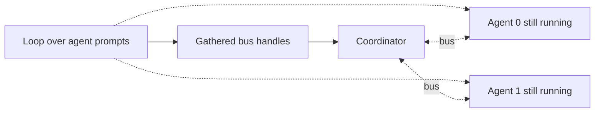

# Loops

A `Loop` runs what is inside it once for each item in a list or a stream. It
can also just keep going until something inside says stop.

```weft
double = Loop(values: List[Number]) -> (results: List[Number | Null]) {
  over: ["values"]

  step = ExecPython(n: Number) -> (out: Number) {
    n: self.values
    code: "return {'out': n * 2}"
  }
  self.results = step.out
}
double.values = [1, 2, 3]
show = Debug { data: double.results }
```

Outside the loop, `values` is a list. Inside, `self.values` is whichever number
this iteration got. `self.results` takes one result per iteration, and
`double.results` hands back the gathered list, `[2, 4, 6]`.

## When the next iteration starts

Loops go one at a time unless you say otherwise. The next iteration starts once
this one's connections to the output boundary have settled, which in the
example above means `step.out` has produced something or closed.

Other work inside the body can still be going. If a step emits its result and
then carries on doing something, the loop moves on while that is still running.
A branch with no connection to a loop output holds nothing up.

So if you need an action to actually finish first, wire an output that the
action emits *after* it finishes into a loop output or into `self.done`.
Sequential on its own does not make disconnected body work wait.

Set `parallel: true` to launch the iterations together. Gathered results still
come back in input order even when later ones finish first. There is no setting
for how many may run at once; `max_iters` caps the total launched, not the
width.

## The four kinds of port

What a port does depends on the signature plus the `over` and `carry` lists:

| Port | Outside the loop | Inside the body |
|---|---|---|
| Input named in `over` | `List[T]` or `Generator[T]` | The current item, a `T` |
| Any other input | Its declared type | The same value, every iteration |
| Output named in `carry` | Seed goes in, final value comes out, same type | Read the previous value, write the next |
| Any other output | `List[T \| Null]` | Write one `T` for this iteration |

That last row is a **gather**. Each iteration gets a slot, in index order, and a
wired output that closes leaves `null` in its slot. So the signature has to
allow `Null`, or you get `gather-output-must-be-nullable`.

The loop also gives you `self.index`, the iteration number counting from zero,
and `self.done`, which you write into to stop a sequential loop. Do not declare
an input called `index` or an output called `done` yourself.

## Carrying a value between iterations

Name an output in `carry` and it becomes an accumulator. The compiler makes a
matching input for the starting value:

```weft
sum = Loop(values: List[Number]) -> (total: Number) {
  over: ["values"]
  carry: ["total"]

  add = ExecPython(n: Number, previous: Number) -> (next: Number) {
    n: self.values
    previous: self.total
    code: "return {'next': previous + n}"
  }
  self.total = add.next
}
sum.values = [1, 2, 3]
sum.total = 0
show = Debug { data: sum.total }
```

`self.total` starts at `0`, then reads `1`, then `3`, and `6` comes out at the
end. A carry is a single value, so it does not need the list type a gather
does. Carry only works in sequential mode.

If a carry write closes, the previous value stays. The seed input the compiler
makes is required, so a closed seed skips the whole loop; you can declare that
seed optional yourself, and an absent optional seed uses the type's zero value,
`0` or `""` or `[]`.

A `null` seed gets replaced by that zero value too. Actual `null` writes later
on stay as values if the carry type allows them, and they are not the same as a
closed write.

## Stopping from inside

Write a true or false value into `self.done`:

```weft
attempts = Loop() -> (last: Number) {
  carry: ["last"]
  max_iters: 10

  step = ExecPython(previous: Number) -> (next: Number, finished: Boolean) {
    previous: self.last
    code: "n = previous + 1; return {'next': n, 'finished': n >= 3}"
  }
  self.last = step.next
  self.done = step.finished
}
attempts.last = 0
show = Debug { data: attempts.last }
```

That stops after the third iteration and gives back `3`. A `true` stops another
iteration starting. `false`, nothing at all, or a closed wire all mean carry on.

A sequential loop needs something that can end it: a list in `over` to run out
of, a `max_iters` cap, or a wire into `self.done`. The compiler checks one of
those exists. It cannot check that your condition will ever come true.

`max_iters` runs from `0` up to `4294967295`. The compiler currently accepts
bigger integers than that and they fail at run time. A cap of zero launches
nothing, and so does an empty input list; both give you empty gather lists and
the carry values you started with.

## Several lists at once

Put more than one list input in `over` and they are read together:

```text
over: ["names", "ages"]
```

Iteration zero gets `names[0]` and `ages[0]`, iteration one gets the next pair,
and so on. It stops at the shortest list unless you set
`trim_on_mismatch: false`, which makes different lengths a failure instead.

An input left out of `over` is available unchanged in every iteration, which is
what you want for a prompt or a service connection.

## Looping over a stream

Declare a `Generator[T]` input and name it in `over`. `Range`, for instance,
emits a `Generator[Number]` that can feed a loop one number at a time.

A sequential stream loop takes the next item when the previous iteration
reaches the output boundary. A parallel one launches an iteration per arriving
item. The end of the stream replaces running out of list as the normal way to
stop, and an empty stream is fine.

Only one stream can be in `over`, and it has to be the only thing there. A
generator cannot be a shared input handed to every iteration. If the producer
fails, the loop fails.

If the loop stops early while the producer is waiting for an item to be taken,
that delivery fails. For coordinating an early stop, read
[the stream termination rules](live-channels.md#stopping-early-can-fail-the-run).

## Results can leave before the body is done

A loop can hand back its gathered results while work it started is still
running. Each iteration might start an agent that emits a `Bus` handle and then
waits for messages: the loop gathers those handles into `List[Bus | Null]`, and
a coordinator outside talks to the agents.



The loop waits for its iterations to settle their output-boundary connections
and no further. It does not kill what they left running, and the run as a whole
still waits for that work. If the next iteration depends on the current one
finishing, wire a completion output.

### Unconnected outputs currently fail

A loop with nothing connected to its output boundary can start that boundary
with the wrong iteration context. At the top level the error reads
`LoopOut ... fired with empty frame stack`. A declared gather or carry input
left unwired can also fail with `neither closed nor present in input bag`, even
when another boundary input is wired.

So wire every declared output from something in the body. For a loop that only
exists for a side effect, wire a boolean completion output into `self.done`,
where `false` carries on and `true` stops. These are current limitations rather
than the ordinary business of a branch closing.

## Skips and failures

`_should_flow` gates a loop the same way it
[gates a group](groups.md#turning-a-whole-group-off). A closed required list
input or carry seed also skips it. A closed ordinary shared input reaches the
body, where each child decides for itself.

A failed branch can close a gather write, leaving `null` in that slot. The
failure is still in the run, and the null does not turn it into a success.
Closed carry writes keep the previous value, and closed done writes do not stop
anything.

The compiler rejects these outright:

| What you wrote | The complaint |
|---|---|
| Parallel with a carry | `parallel-with-carry` |
| Parallel with a done connection | `parallel-with-done` |
| Parallel with no `over` input | `parallel-without-over` |
| A port in both `over` and `carry` | `over-and-carry-overlap` |
| Nothing that could ever end it | `loop-unbounded-no-termination` |

Unknown configuration keys and wrong value types are errors too. The full list
is in [diagnostics](diagnostics.md).

## Nested loops

The compiler makes one set of body steps. weft tells iterations apart by their
position in the nested loop stack, so values from separate iterations stay
separate without copying the graph.

It still tracks what was launched, what has been gathered, the carry state and
the termination. An outer loop emitting outwards does not cancel a nested loop
that is still working.
