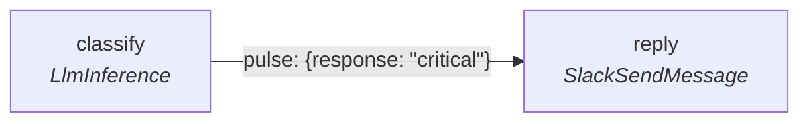
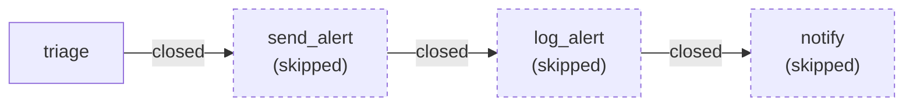
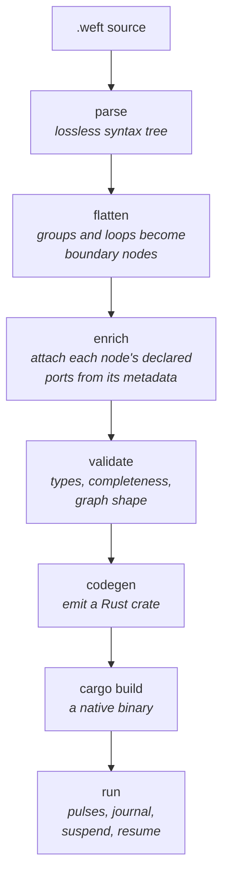

# How a weft program runs

Most people arrive already holding a model, and it is nearly right, which is
the hard case.

The model is: it is a DAG. Nodes are tasks, edges are dependencies, something
walks the graph in topological order and runs each task when its dependencies
are done. Airflow, Prefect, a build system.

That model gets you a long way and then breaks in three places. It cannot
express a node that produces nothing. It cannot express the same node running
twice at once on different data. And it cannot express a task that pauses for a
week.

All three come from the same difference: in weft, nothing walks the graph.
Values move, and nodes react to them arriving.

## Pulses

When a node finishes its work it **emits** values on its output ports. Each
emission becomes a **pulse**: a small object carrying a value, addressed to
exactly one input port on exactly one node.



A pulse carries more than its value:

| Field | What it is |
|---|---|
| `value` | the JSON value being delivered |
| `target_node` / `target_port` | where it is going |
| `color` | which execution it belongs to |
| `frames` | which loop iteration it belongs to |
| `closed` | whether it carries a value at all |

A pulse sits at its destination port and waits. **A node fires when every one
of its required input ports is holding a pulse**, and all of those pulses
agree on their color and their frames. Then it fires, consuming them.

A node with no inputs has nothing to wait for, so it fires immediately. That is
where an execution starts.

## What a firing is

One firing is one call to the node's `run` body, with those pulses as its
inputs. It produces zero or more emissions and then returns.

A firing is not a process. It is an execution id and an iteration number, so
the same node can be firing four times at once inside a parallel loop, told
apart by those numbers. That is the second place the DAG model breaks, and it
is why weft talks about firings rather than about running a task.

## The closed pulse

A node does not have to emit on every output port. When it emits on some ports
and not others, the ports it left out get **closed**: a pulse is sent down
each of those wires carrying no value, meaning "nothing will ever arrive here,
at this color, at these frames. Stop waiting."

What the receiving node does with it depends on one thing:

- If the closed pulse lands on a **required** input, the node cannot run. It is
  **skipped**, and it closes all of its own outputs in turn.
- If it lands on an **optional** input (declared with a trailing `?`), the node
  fires anyway, with that input simply absent.
- If it lands on `_should_flow`, the node is skipped whatever else arrived:
  that port is the one that decides whether the node runs at all, and a
  closure on it means nothing ever said yes.

So a skip cascades forward, closing everything downstream, until it reaches a
node that opted into handling absence.



## Branching is just that

There is no `if`, no `try`/`catch`, and no conditional edge anywhere in the
language. A branch is a node that did not run, and everything behind it
closing in turn.

Every node has a `_should_flow` input deciding whether it runs at all. Leave it
alone and the node runs. Wire it, and a `false` (or a closure, meaning whatever
decides never spoke) skips that node, which closes its outputs, which skips
everything behind it.

```weft
reply = SlackSendMessage {
  _should_flow: review.escalate_approved
  text: classify.response
}
```

Both branches of a conditional exist in the graph; the one that was not taken
goes dark. Two nodes turn that into a shape you can read:

- `Switch` tests a value against its cases and emits `true` on the one port
  the winning case names, closing the rest. Each case's kind is its test
  (`equals`, `in`, `between`, `otherwise`, and the rest). Wire a case's port
  into the `_should_flow` of whatever that branch runs.
- `FirstInOrder` takes the branches back to one wire: it emits the first of its
  inputs that carried a value, in the order they are written, so the answer a
  person approved can sit above the automatic one and never be overtaken.

A `Group` or a `Loop` takes `_should_flow` too, so one line turns off a whole
subgraph: it closes the group's outputs, which closes everything inside it,
however deeply nested.

The same rule explains the rest:

- A node that fails closes its outputs, so a failure propagates exactly like an
  absent value, and a downstream node with an optional input is the recovery
  path.

- A trigger that did not fire closes its outputs, so the branches belonging to
  other triggers go dark and the branch belonging to the one that fired runs.
- A loop iteration that failed to write its gather port leaves `null` at that
  index, which is why a gather output is typed `List[T | Null]` and the
  compiler makes you say so.
- A node whose every input is optional would run even when everything upstream
  is dead, which is a bug you almost never want, so the compiler warns and
  suggests `@require_one_of`.

## Groups and loops are compile-time only

Neither exists at run time. The compiler flattens a group into two boundary
nodes and a loop into a pair of them, and their children become ordinary nodes.

So what the executor ever sees is one flat graph of nodes and pulses. Nesting,
folding and iteration were all resolved by the compiler before it started.

## Frames

A `frames` value is a stack of loop iteration indices. Top level is the empty
stack. Inside a loop's third iteration it is `[2]`. Inside the fifth iteration
of a loop nested in that one it is `[2, 4]`.

Two pulses only meet at a node if their frames match, so iteration 2's data can
never combine with iteration 4's. Nothing copies the graph per iteration: there
is one graph, and pulses that know which iteration they belong to.

## What actually runs

A weft program has no `main`, and nothing declares an entry point. The runtime
works out what to run by starting from what was asked for and walking
**backwards**.

What was asked for is the **output nodes**: the ones whose firing is the
deliverable. Sending the message, generating the image, writing the row,
showing the result. A node's author declares it with
`features.isOutputDefault`, and a project can override it per instance with
`_is_output`.

**A manual run** takes every output node, walks upstream from each, and
executes the union. Whatever no output depends on does not run.

You can narrow that set:

```bash
weft run --target daily_report --target alert
```

which runs those two and everything they need, and nothing else in the project.
It is the same walk given a smaller starting set, which is why it costs nothing
to have. A target has to be an output node; aiming a run at a middle node is
refused, with the fix named. In the graph, right-click an output node to
target it; the Run button then says how many targets it is aimed at.

The boundary is visible and it holds. A node just outside the aimed set that
still receives a value from inside it shows as skipped with "it is outside the
part of the graph this execution runs", once, and everything past it stays
blank rather than painting the rest of the project skipped. The boundary is
written into the run itself, so resuming a suspended aimed run keeps it.

An aimed run answers to its own subgraph, not to the whole project. Two
consequences, both reading "its subgraph" as the joined upstream walk from
every target at once:

- **If no trigger sits anywhere in that subgraph**, the run is an ordinary
  one-shot, so the Run button appears next to Activate / Deactivate even in a
  project full of triggers. This is how a maintenance branch works: an output
  the triggers cannot reach, fired by hand whenever you need it, for example
  the enrollment door in the
  [telegram example](https://github.com/WeaveMindAI/weft/tree/main/examples/telegram-image-bot).
- **Only the infra inside that subgraph gates it.** A run cannot start while
  an infra node it would touch is not running, the same rule as a plain run;
  but infra elsewhere in the project has no say, since this run never touches
  it. The Run button greys out accordingly, and `weft run --target ...`
  refuses with the same message until you `weft infra start`.

**A trigger fire** narrows that twice. It starts at the trigger that actually
fired and walks downstream to see which outputs that trigger can reach. Then it
walks back up from those, and a node is in the run when one of those outputs
depends on it without passing through another trigger.

Both walks are there for a reason.

**Starting from the fired trigger** keeps one entry point out of another's
work. An output it cannot reach belongs to some other trigger, and re-running
that on every fire would be wrong.

**Stopping at triggers on the way up** keeps a trigger's own inputs from
re-running. At fire time a trigger's outputs are the event, not a function of
its inputs, which were read once at activation. So a node that only feeds a
trigger has nothing to contribute to a fire. If it also feeds a normal path to
a targeted output, it runs through that path.

Every other trigger in the subgraph is kicked with no payload, which closes its
outputs, and [the skip cascade](#the-closed-pulse) prunes the branches that
belong to it.

The boundary is drawn a little differently from an aimed run's. A node the
fired trigger cannot reach at all belongs to another program in the file, and a
value that spills into it from a shared node (one database feeding two
programs) is dropped with no row. A node the trigger can reach but no output
depends on is yours, and it shows the "outside the part of the graph this
execution runs" skip: that is how you find a side-effect node you forgot to
mark as an output.

Four things follow, and the third is why `isOutputDefault` is worth thinking
about at all:

- **A branch wired to no output never executes.** A half-built path sitting in
  the file is not a running path.
- **One file can hold several programs.** Each trigger pulls its own subgraph,
  and a middle section both of them need is picked up by whichever one fired
  without you saying so. What that buys you when laying a project out:
  [one file, several programs](../start/reading-the-graph.md#one-file-several-programs).
- **A node that is the deliverable has to say so.** Leave `isOutputDefault`
  unset on a node that sends the message, and a user who drops it at the end of
  a chain and hits run gets nothing, because nothing downstream asked for it.
- **A trigger that reaches no output has nothing to run**, so its fire is a
  no-op rather than an error.

## When it ends

An execution is finished when no pulse is in flight and no node is waiting for
one. There is no terminal node and nothing declares completion.

Two ends that are not completion:

- **Suspended.** Every live firing is parked on a wait for an external event. The
  worker exits. The execution is alive and costs nothing.
- **Stuck.** The engine can prove no remaining node can ever proceed, because
  every one of them is waiting on one of the others. That is a graph-shape bug
  and it fails loudly rather than hanging.

And one end that is a decision: **cancelled**. A person pressed Stop, or
another run of the same project stopped this one. A run can tag itself, and
any sibling carrying that tag can be stopped, even one parked on a person or
a timer. The journal records who did it. For how a node asks for that, go
and read [Stopping other runs](../nodes/steering-executions.md).

## The journal, and why waiting is free

Everything above happens in a worker process, in RAM: pulses are values in
memory and the drive loop is an ordinary loop.

Alongside it, the worker writes an append-only **journal**, one row per event,
as it goes. Nothing reads that journal back during a normal run. It is read
only when a worker has to rebuild an execution it did not run: it folds the
rows in order, reconstructs the pulse table and which nodes completed or
suspended, and carries on from there.

That buys:

- **A human pause costs a database row.** `HumanQuery` parks a firing, and when
  the last live firing parks, the worker exits. Ten thousand executions waiting
  on ten thousand people are ten thousand rows and no processes.
- **Crashes are survivable.** A worker that dies mid-execution is replaced, and
  the replacement folds the journal and continues, without re-running the nodes
  that had already completed.
- **A failure is readable.** A run from last Tuesday is still legible node by
  node, with the actual values on the actual wires.

Weft's execution guarantee is at-least-once. A crash can lose the write that
recorded a node's completion, so a node that had already finished when its
worker died **is re-run** by the replacement. When a node's work must not
happen twice, `ctx.run` makes it happen once and replays the recorded result
afterwards. See [Surviving a restart](../nodes/durable-execution.md).

## The compiler's half

None of the above is checked at run time. Before an execution exists, the compiler has already read the whole
graph and refused it if:

- any connection's types do not match,
- any required input is unwired,
- there is a cycle in the wire graph,
- a type variable was never pinned to anything concrete,
- a node's own config validation failed,
- a loop's configuration is internally contradictory,
- a trigger sits somewhere a trigger cannot sit.

The full list is in [What the compiler refuses](diagnostics.md).

What is left after a successful compile is external: a service is down, an API
errors, a person never answers.

## The shape of the whole thing



Read the next chapters in whatever order you need. [Syntax](syntax.md) is the
surface, [Types](types.md) is what the checker checks, and
[Groups](groups.md) and [Loops](loops.md) are the two structures that make
large programs stay readable.
