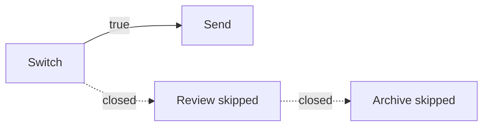

# How a weft program runs

weft calls the steps of a program **nodes**. A node can send its answer before
it has finished, or sit waiting for a week while the rest of the program
carries on. So if you want to predict what a program will do, do not read it
top to bottom. Look at what arrives at each step's inputs.

## Values arrive one at a time

When a step emits, the value travels along every arrow leaving that output.
Each delivery is a **pulse**, aimed at one input, and carrying a tag saying
which run it belongs to. One output wired to three inputs is three deliveries.

A step waits until every input with an arrow into it has either a value or a
closure. Optional inputs count too: an arrow is an arrow. Inputs can also be
satisfied by a value written into the step or by a default, so not everything
needs an arrow.

Once every wired input has settled, weft decides whether the step runs or is
skipped. A step with nothing wired into it has nothing to wait for, so weft
just starts it when the run begins.

## How a branch stops the steps after it

A **closure** means: nothing is ever coming out of here, for this run. It is
how a step says no rather than saying nothing. Everything downstream can then
stop waiting for it.

It is not the same as `null`. `null` is a value, and a port whose type allows
`null` will take it like any other.

For an ordinary step:

- A closed required input skips the step.
- A closed optional input lets the other inputs decide.
- If every input closed, the step skips, and so does one whose `@require_one_of` inputs all closed.
- `_should_flow` set to false, or closed, skips the step.

A skipped step closes its own outputs, which can skip the next step, and the
next, until the closures reach something that can carry on with what it has.



Streams close differently. A closure on a stream is the stream's end rather
than a skip, so a reader whose stream carried nothing still runs and sees that
nothing came.

A failed step also closes whatever it had not already sent. An output it
already sent does not get taken back.

## Choosing a branch, and joining back up

Every step has `_should_flow`, and it defaults to true. Wire a true or false
value into it to decide whether that step runs.

`Switch` gives you one output port per case. It tries the cases in the order
you wrote them, and the first one that matches emits `true` while every other
one closes. Wire a case's port into a step's `_should_flow` and that step runs
on that case only. If nothing matches and you gave it no `otherwise`, they all
close.

To bring two alternative answers back into one arrow, use `FirstInOrder`. It
waits for its wired inputs to settle and then takes the first one that
actually supplied a value, **in written order**. Written order is the
priority, so moving those lines around changes which answer wins. Which one
arrived first makes no difference.

Say a sensitive question goes to a person for approval and everything else
goes straight ahead. Only one of those two can supply an approval, and
`FirstInOrder` takes whichever it was.

## One step, several runs at once

A **firing** is one go at one step. Three things say which firing you are
looking at: the run, the step, and the loop iterations it sits inside. Inside
a parallel loop the same step can have several firings alive at the same time.

Those iteration numbers are called **frames**. Work at the top level has none,
and work inside two nested loops carries one frame for each. weft only ever
combines inputs whose run and frames match, which is what stops iteration
three eating iteration four's answer.

An ordinary output emits at most once per firing, though it can emit on one
output now and another later. Whatever it never mentions is closed when it
finishes. Generators and buses have their own rules, in [Live
channels](live-channels.md).

Groups and loops do not exist at run time. The compiler turns each group into
a pair of boundary steps and each loop into a `LoopIn` and `LoopOut`, and
hands weft one flat graph with the scope information attached. So folding a
group in the editor costs nothing at run time, and neither does nesting groups
inside groups. For the boundary rules, read [Groups](groups.md) and
[Loops](loops.md).

## What happens when you hit run

A **manual run** starts every step at the top level that has nothing wired
into it, plus every trigger in the project, wired or not. Triggers get no
event on a run like that, so they close their outputs. Only the paths that do
not need an event go anywhere.

To run part of a project:

```bash
weft run --target daily_report --target alert
```

weft takes those steps and everything feeding into them, stopping the walk
when it reaches a trigger. Whole groups and loops come along if a target is
inside one. A step that several branches share does not drag those other
branches in.

A **trigger firing** picks the work downstream of that trigger, plus whatever
that work needs upstream, again stopping at other triggers. Only the trigger
that actually fired gets the event; any others close. Two triggers can share
the steps in the middle without becoming one run.

## How a run ends

A run is finished when there is no work left and nothing still in flight. It
does not need an end step. A run can also end two other ways:

| State | What it means |
|---|---|
| Failed | A step failed, or weft could not get any further |
| Cancelled | A person, or another run, stopped it |

A run can also pause without ending. Suspended means a step is parked waiting
for an answer from outside, and the run carries on when that answer comes.

If work is left that can never proceed, weft reports the run as stuck and
names the steps and inputs involved. A run parked on a person's answer is
suspended, not stuck.

## What survives a restart

As a run goes, the worker writes down each thing that happened, in a log
called the journal. Those records are what the graph shows you. They are also
what a replacement worker reads to rebuild a run that was interrupted. A step
whose completion was safely written down does not run again.

A step whose completion was not written down runs again from the top.
`ctx.run` gives back a saved result rather than redoing the work, but an
external action can still happen twice if the worker died before the result
was recorded. Read [Surviving a restart](../nodes/durable-execution.md) before
you put side effects around a wait.

## What the build catches for you

The compiler checks that every arrow's types fit, that every required input is
covered, that no wire crosses a scope boundary it should not, that there are
no cycles, and that the loop and channel restrictions hold. It also runs
whatever validation rules a step declares for itself.

Some things are checked when you build and some only when you run, so a build
can succeed and a value can still be rejected later, when a step emits
something its declared output type does not allow.

It cannot check whether a step does useful work. A model can return a
perfectly typed answer that is wrong. For the exact rejections, read [What the
compiler refuses](diagnostics.md). To start writing weft yourself, carry on to
[Syntax](syntax.md).
