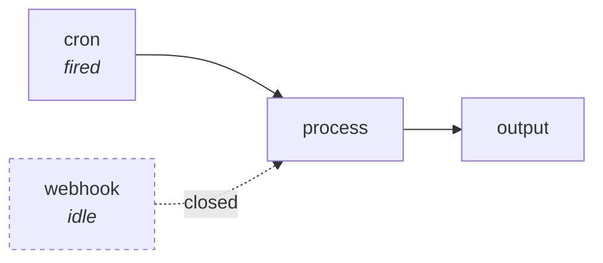

# Triggers

A trigger node is what starts an execution from outside. A web request, a
timer, a form submission, a message landing in Slack, an email arriving.

It is an ordinary node whose metadata sets `isTrigger: true`. You wire its
outputs downstream like any node. The difference is that an external event
fires a fresh execution carrying that event's data.

```weft
api = ApiEndpoint { path: "hello" }
reply = Reply
reply.started = api.started
```

## Two phases

The language drives a trigger through two phases, and a trigger's body never
inspects which one it is in. The runtime calls a different function for each.

**Trigger setup** happens when you activate the project. The trigger registers
what it wants to watch: an endpoint path, a cron spec, a subscription to a
provider's events. Its upstream nodes run during this phase, and whatever they
delivered is **saved with the registration**.

**Fire** happens each time the event occurs. A fresh execution starts, the
trigger's body runs exactly once, and the event's data arrives on a separate
channel from its inputs.

That split has a consequence worth knowing. A trigger's inputs are read
**once, at activation**, and replayed on every fire, so nothing upstream of a
trigger runs again when it fires, and re-activating the project is what
refreshes those values. If you want something computed fresh per event, compute
it **downstream** of the trigger.

## What runs on a fire

The fired trigger's reachable outputs, plus everything those outputs depend on,
stopping at trigger nodes. So sibling branches it cannot reach do not run, and
neither do the other triggers in that subgraph: their output ports close, and a
node fed by several triggers proceeds with the firing branch.

Why the runtime picks the subgraph that way, and what it buys you:
[What actually runs](mental-model.md#what-actually-runs).



If you run a project by hand, no trigger fires: every one of them closes, and
the run exercises only the paths that do not need one. To exercise a trigger's
path, fire it. The editor can send a hand-written payload.

## The built-in kinds

| Node | Fires when |
|---|---|
| `ApiEndpoint { path }` | an HTTP request arrives, and a node can answer it live |
| `LiveSocket { path }` | a WebSocket connects, and nodes hold a two-way conversation |
| `Cron { cron }` | the schedule says so |
| `HumanTrigger { fields }` | a person submits a form |

Beyond those, node authors write triggers that subscribe to an event stream,
poll a URL, or hold an outbound socket, using the runtime's signal kinds. See
[Writing a trigger](../nodes/writing-triggers.md).

For triggers that fire on something happening at a connected service, read
[Events from a service](../connections/events.md), which explains why some of
them need your weft reachable from the internet and some do not.

## Form-derived ports

`HumanTrigger` and `HumanQuery` do not have fixed ports. Their ports come from
the fields you configured, resolved at compile time.

```weft
review = HumanQuery {
  title: "Escalate this ticket?"
  fields: [
    { "kind": "approve_reject", "key": "escalate" },
    { "kind": "text_input", "key": "reason" }
  ]
}
```

That produces three outputs: `review.escalate_approved` and
`review.escalate_rejected` as Booleans, and `review.reason` as a String. You
never declare them, and changing the form changes the ports, with every
existing wire re-checked against the new shape.

## What the compiler refuses

| Error | What it stops |
|---|---|
| `graph-cycle` | a cycle in the wire graph. Iterate with a `Loop`; exchange feedback over a bus. |
| `trigger-in-loop` | a trigger inside a `Loop`. A trigger is an entry point, and an entry point per iteration is meaningless. |
| `trigger-into-trigger` | a trigger wired into another trigger. There is no phase in which that delivers. |
| `trigger-into-infra` | a trigger wired into an infra node. Provisioning happens before any fire exists. |

## Activation

A project with triggers has to be turned on:

```bash
weft activate            # register every trigger, mint the URLs
weft deactivate          # drop them
```

`activate` prints the live addresses it minted. Re-activating re-registers
everything and refreshes each trigger's saved input snapshot.

If you deactivate a project with work in flight, you have to say what happens
to it, so `deactivate` takes a mode:

| Mode | What happens to suspended executions |
|---|---|
| `wipe` | dropped |
| `hibernate` | kept, resumable when reactivated |
| `park` | kept, and queued to run on reactivation |

and a `--running-policy` of `wait` or `cancel` decides what happens to
executions currently mid-flight. [The CLI](../running/cli.md) lists the
defaults.

## If a trigger cannot be served, activation stops there

It refuses, naming what is missing, rather than registering into a state where
it looks active and never fires. That way a misconfigured trigger fails while
you are looking at it. See
[Design principles](../thinking/design-principles.md).
