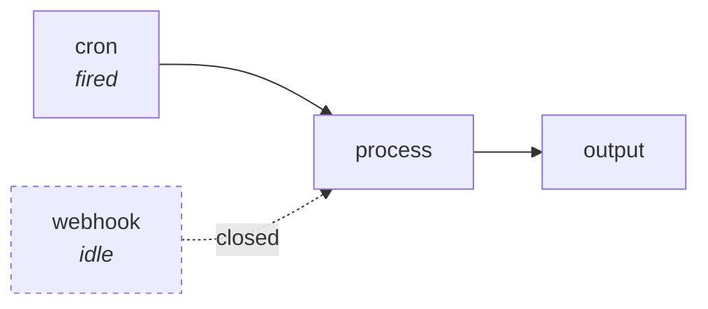

# Triggers

A trigger is a step that starts a run from outside: a web request, a timer,
somebody submitting a form, a message landing in Slack, an email arriving.

It is an ordinary step whose metadata sets `isTrigger: true`, and you wire its
outputs like any other. The difference is that an event from outside starts a
fresh run and hands the trigger that event's data.

```weft
api = ApiEndpoint { path: "hello" }
reply = Reply
reply.started = api.started
```

## Two phases

A trigger goes through two phases, and its own code never has to ask which one
it is in, because weft calls a different function for each.

**Setup** happens when you activate the project. The trigger registers what it
wants to watch, such as an endpoint path, a cron spec, or a subscription to a
provider's events. Everything upstream of it runs now, and whatever those
steps produced is **saved along with the registration**.

**Fire** happens every time the event actually occurs. A fresh run starts, the
trigger's code runs once, and the event's data arrives separately from its
inputs.

So a trigger's inputs are read **once, at activation**, and replayed on every
fire. Nothing upstream of a trigger runs again when it fires, and
re-activating the project is what refreshes those saved values. If you want
something worked out fresh for each event, put that step **downstream** of the
trigger.

## What runs on a fire

A fire runs one program, and the run is pinned to it. The set of steps is
written into the run itself, so it still holds if the run is resumed later,
and the rest of the file is left alone. For what goes into that set and why,
go and read [What happens when you hit
run](mental-model.md#what-happens-when-you-hit-run).



If you run a project by hand, no trigger fires. Every one of them closes
instead, so the run only exercises the paths that do not need an event. The
editor can send a payload you wrote yourself to fire one on purpose.

## The built-in kinds

| Node | Fires when |
|---|---|
| `ApiEndpoint { path }` | an HTTP request arrives (nodes can answer it live) |
| `LiveSocket { path }` | a WebSocket connects, and nodes hold a two-way conversation |
| `Cron { cron, timezone }` | the schedule says so, on that zone's clock (UTC unless you pick one) |
| `HumanTrigger { fields }` | a person submits a form |

Beyond those, you can write a trigger that subscribes to an event stream,
polls a URL, or holds a socket open, using weft's signal kinds. For that, go
and read [Writing a trigger](../nodes/writing-triggers.md).

Some triggers need the outside world to reach your machine, and some do not.
Anything a provider has to send events *to*, such as a webhook, needs your
weft to have a public address, which is one command: `./setup.sh --public-url`.
Anything that dials out instead, such as email over IMAP or Slack in Socket
Mode, works from behind a home router with nothing set up. Activation is where
you find out which one you have, and it refuses with "this trigger needs your
weft to be reachable from the internet" if you need an address and have not
got one. For which triggers are which, read
[events from a service](../connections/events.md).

## Form-derived ports

`HumanTrigger` and `HumanQuery` have no fixed ports. Theirs come from the form
fields you configured, worked out when the program is compiled.

```weft
review = HumanQuery {
  title: "Escalate this ticket?"
  fields: [
    { "kind": "approve_reject", "key": "escalate" },
    { "kind": "text_input", "key": "reason" }
  ]
}
```

That gives you three outputs: `review.escalate_approved` and
`review.escalate_rejected`, both booleans, and `review.reason`, a string. You
never declare any of them. Change the form and the ports change with it, and
every wire you already drew gets re-checked against the new shape.

## What the compiler refuses

There are five complaints a project with triggers can run into: `graph-cycle`,
`trigger-in-loop`, `infra-in-loop`, `trigger-into-trigger` and
`trigger-into-infra`. The fix for each is in [What the compiler
refuses](diagnostics.md).

## Activation

A project with triggers has to be turned on:

```bash
weft activate            # register every trigger, mint the URLs
weft deactivate          # drop them
```

`activate` prints the live addresses it made. Activating again re-registers
everything and refreshes each trigger's saved inputs.

If you deactivate a project while work is still in flight, you have to say
what should happen to that work, so `deactivate` takes a mode:

| Mode | What happens to suspended executions |
|---|---|
| `wipe` | dropped |
| `hibernate` | kept, resumable when reactivated |
| `park` | kept, and queued to run on reactivation |

A `--running-policy` of `wait` or `cancel` decides what happens to runs that
are mid-flight right now. For the defaults, go and read [The
CLI](../running/cli.md).

## If a trigger cannot be served, activation stops there

It refuses and names what is missing, rather than registering something that
looks active and never fires. That way a misconfigured trigger fails while you
are still looking at it. See [Design
principles](../thinking/design-principles.md).
