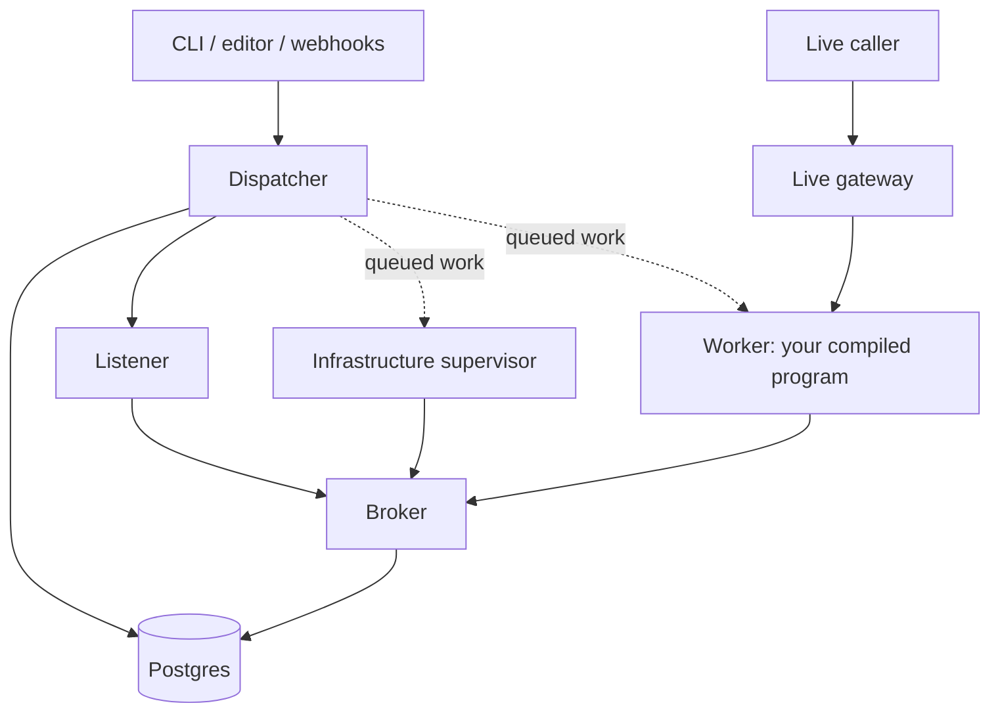

# How the runtime is built

Four kinds of process, one job each.

| | What it does | What it never does |
|---|---|---|
| **Worker** | Runs your compiled program | Nothing else. It is your program |
| **Dispatcher** | Decides what runs where, and answers every request about a project or a run | Run your step code |
| **Listener** | Holds the timers, the open sockets and the subscriptions | Run your step code, or know which project it serves |
| **Supervisor** | Runs kubectl for the containers your program asked for | Run your step code, or share a project with another supervisor |

Anything that has to survive a crash goes into Postgres, and all four read it
back from there.

The dotted arrows are rows in a table, not calls. The dispatcher never phones a
worker. It writes the job down, and a worker claims it.

## Why it is rows and not calls

A row in a table survives the process that wrote it. If the dispatcher dies
between deciding a job and a worker taking it, the job is still there. If a
worker dies holding a job, its claim expires and another worker picks it up.

Claiming is `FOR UPDATE SKIP LOCKED`, so two workers never take the same job.
A claim lasts 60 seconds and the holder renews it every 15. Every job carries a
key that makes a duplicate a no-op, so the same work queued twice runs once.

That last part is why everything the runtime does has to be safe to redo.

## What happens when an event arrives

A listener holding a timer or a subscription reports the event. The dispatcher
works out which run it belongs to and makes sure a worker exists. The worker
claims the job, fetches your program by its hash, and runs the graph, writing
what happens into [the journal](the-journal.md) as it goes.

An HTTP or WebSocket caller takes a different road. It arrives at the live
gateway, which routes it to the one worker holding that conversation and keeps
the connection open while your program runs. For that, go and read
[putting it on a URL](../build/public-address.md).

## The worker

One compiled program, running as a pod, serving as many runs at once as it can.
The image is named after a hash of its contents, so two projects that compile
to the same thing share an image.

When a project's workers get close to their memory limit, weft starts another
pod. A worker with nothing left to claim shuts itself down after 30 seconds. It
caches every program it fetches, keyed by hash, so a restart is cheap.

A worker never touches Postgres. Everything it needs goes through the broker.

## The dispatcher

It answers every request about a project or a run, and it decides which worker
runs what and when workers start and stop.

It never sees your `nodes/` directory. Your CLI reads your local catalog and
compiles the program before submitting it, so the dispatcher only ever handles
a compiled definition.

Anything shared lives in Postgres, because the next request may land on a
different dispatcher pod with nothing in memory.

## The listener

One pool serves every project on the installation. A listener holds the timers,
the sockets and the subscriptions, and turns whatever arrives into a message
the dispatcher can route.

Listeners are the only tier that tells one kind of event source from another.
So a new kind of trigger is listener code and nothing else, and no other tier
grows a branch for it. Each listener reports how close it is to its memory
limit, and weft puts the next event source on the one with room.

## The supervisor

It applies your infrastructure and watches whether what it created is healthy.

Before it issues any cluster command it takes an exclusive lease on the
project, because two processes running kubectl against the same namespace
corrupt each other. It keeps renewing that lease while the work runs, and if it
expires another supervisor picks the project up.

A supervisor can still die between changing the cluster and recording that it
did. The next one works out what to do from what the cluster actually looks
like, rather than trusting the record.

## The broker, and who may talk to what

The dispatcher and the broker reach Postgres directly. Everything else goes
through the broker: listeners, supervisors and workers.

The broker checks every request. It asks Kubernetes to verify the caller's
service-account token, resolves that to a tenant and a role, and then checks
whether that particular caller is allowed to touch the thing it asked for. Your
program's worker runs untrusted node code, so it never gets a database
connection.

The broker also handles storage and connection work, including OAuth exchanges
and subscription setup. Your worker calls providers itself, so a slow provider
never queues up behind the broker.

Network policies limit where the broker can go, with holes for Postgres and the
Kubernetes API. If your object store sits on a private range those rules cannot
work out, set `WEFT_STORE_ALLOW_CIDR` to it.

The local management API has no authentication of its own, so whoever can reach
it can do anything a project owner can. Keep it on an interface you control.
For the rest of the boundaries, go and read the
[security policy](https://github.com/WeaveMindAI/weft/blob/main/SECURITY.md).

## What happens when something dies

Ownership is a lease with an expiry, so a replacement claims expired work
without needing anything the dead process had in memory.

Journal writes carry the identity of the worker that made them, and the
database rejects a write from a worker whose registration has been removed.
That is what stops an evicted worker carrying on and writing history for a run
somebody else has taken over.

Recovery reads the saved events. What it cannot recover is an external action
whose result never got written down. For that boundary, go and read
[the execution guarantee](the-journal.md#the-execution-guarantee).

## Running it on something other than Kubernetes

Seven traits. Implement them and nothing else in the runtime changes.

| Interface | Decides |
|---|---|
| `Authenticator` | Which tenant a request belongs to |
| `TenantRouter` | Which tenant a project belongs to, outside a request |
| `PlacementPolicy` | Which namespace a worker goes in |
| `SandboxPolicy` | Which runtime class it gets |
| `WorkerBackend` | How worker pods get created |
| `ImageBuilder` | How staged source becomes a runnable image |
| `Journal` | Where execution events are written and read back |

Today there is one implementation of each, against a local kind cluster. The
daemon refuses to start against a cluster it did not build, and says so, rather
than half-working on something nobody has tested.
