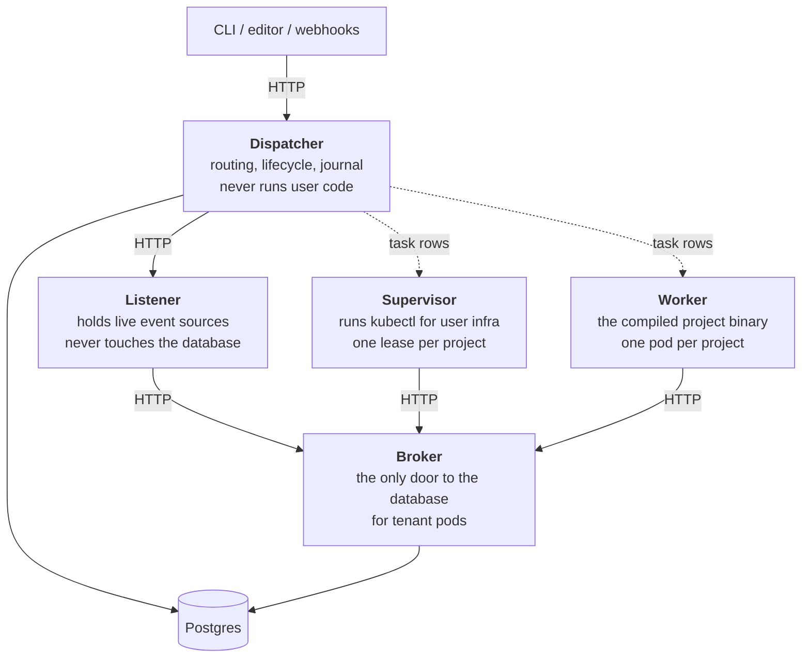

# How the runtime is built

Weft runs as four tiers plus a broker, one job each. If you are operating a
weft, or you want to know why a crash mid-execution does not lose anything,
this is the page.

## Dispatcher

Routes events, manages worker lifecycle, orchestrates infrastructure, owns the
journal, aggregates cost.

It and the broker are the only two things that open a database connection, and
it is the only one that hosts a public URL, so every external address, webhook,
form link and fire token lives on it.

It **never** executes user node code. It never does node-aware work either:
parsing, validation, and catalog reading are client-side, in the CLI, because
the dispatcher pod cannot see your `nodes/` folder and should not need to.

## Listener

Holds live event sources: timers, held sockets, subscriptions, IMAP pipes, poll
loops.

It is the **only** tier that knows about signal kinds. A new kind of trigger is
listener code and nothing else; the dispatcher acts on a kind-agnostic action.

It never touches Postgres and never executes node code. Listener pods are
pooled and tenant-agnostic, and report saturation from real memory pressure
rather than a count, so a pod holding ten cheap timers and one holding one
expensive stream are measured by what they actually cost.

## Supervisor

Runs kubectl for user infrastructure: apply, stop, terminate, and health
watching.

Each project has exactly one supervisor holding a lease on it, so one process
issues cluster commands for that project. The lease expires if the pod dies,
and a sibling claims it. It never touches Postgres and never serves HTTP.

## Worker

The compiled project binary. One pod per project, multiplexing many executions,
shutting itself down after thirty seconds with nothing to do.

It claims work from a queue, runs the drive loop, writes journal rows, and
exits when idle. It holds no project definition of its own: each claim fetches
the definition by hash and caches it by hash.

## The broker

Everything except the dispatcher reaches Postgres through the broker.

The broker sits in its own namespace behind a network policy, verifies each
caller's Kubernetes service-account token, derives what that caller is allowed
to touch, and only then delegates to the database.

It also owns the object store, and it is the one place outbound calls to
tenant-influenced URLs are made: OAuth token exchanges, provider subscribes,
resource lookups. Its egress policy denies every private range, so a crafted
URL aimed at an internal address dies at the network layer rather than at a
validation function somebody has to remember to write.

If your object store sits on a private range, `WEFT_STORE_ALLOW_CIDR` is the
one knob that lets the broker reach it. Keep it as tight as the store needs.

Tenant pods are untrusted and reach the database only through the broker.

## How they actually talk

| From | To | Over |
|---|---|---|
| dispatcher | listener | HTTP, for registration and inspection |
| dispatcher | supervisor | **database rows.** The dispatcher writes a command, the supervisor claims it. |
| dispatcher | worker | **database rows.** Same shape. |
| listener, supervisor, worker | broker | HTTP |
| dispatcher | Postgres | directly |

The dispatcher does not call the supervisor or the worker. It writes a row, and
whichever pod is free claims it with a locking select, so a worker starting
late or a dispatcher pod dying between the write and the claim are ordinary.

## Coordination lives in the database

No dispatcher pod holds anything the others need. Postgres is the single
source of truth and a pod's memory is only a cache.

Ownership is a **lease**: a row with an expiry, renewed by its owner, claimable
by anyone once it expires. That is how a listener pod, a supervisor pod, and a
project's infrastructure each get exactly one owner without a coordination
service.

The rule that follows, for anyone changing the dispatcher: before adding an
in-memory map or counter to shared state, ask what happens if a sibling pod
handles the next request. If the answer involves a stale read or a lost update,
it belongs in Postgres.

## Fencing

Every journal write is stamped with the pod that made it, and a database
trigger rejects writes from a pod whose registration row is gone.

So a worker that was evicted, hung, then woke up cannot corrupt an execution
that has already been taken over: it writes, the write is rejected, and it
learns it is dead.

## The seams

The dispatcher carries a small number of trait-shaped decision points, filled
at construction:

| Seam | Decides |
|---|---|
| `Authenticator` | which tenant is making this request |
| `TenantRouter` | which tenant owns this project, for background loops with no request |
| `PlacementPolicy` | which namespace a worker goes in |
| `SandboxPolicy` | what runtime class it gets |
| `WorkerBackend` | how a worker pod is spawned |
| `ImageBuilder` | how a staged build context becomes a pullable image |
| `Journal` | where events are written |

## Schema

This section and the one after it are for people changing weft itself. Running
programs on it needs neither.

Every table is written down twice, and the two answer different questions.

The **canonical `CREATE TABLE`** lives in Rust, in a group beside the code that
reads and writes the table, and it says what the table is. You edit it in
place. A new database is built from it in one shot, in one transaction under an
advisory lock, with a stamp recording what was applied.

A **migration** is one SQL file under `crates/weft-task-store/migrations/`,
named so the files
sort in the order they were written, and it says how the table changed. The
build walks that directory, so nothing registers a migration; the file being
there is all of it. A database that already exists runs the ones it has not
seen yet. Each database
records which files it has run rather than which release it came from, so any
old database reaches today the same way, and two branches that each add a file
converge whichever order they merge in.

Editing a file that has already run is refused, since a database that ran the
old text can never be told about the new one. Change your mind by writing
another file.

Changing the canonical `CREATE TABLE` with no migration to match fails the
boot, naming the group. Nothing catches that at compile time, so there is also
a test, `schema_agreement`, that builds a database each way and compares what
Postgres ended up holding, down to the columns, indexes, constraints, triggers
and functions.

## Testing, in four layers

Named explicitly in the codebase, so a test's file tells you what kind it is.

**Layer 1, pure functions.** No I/O at all, sub-millisecond, in a `#[cfg(test)]`
block next to the function. Most of the test count lives here.

**Layer 2, wire shapes.** Round-trip every cross-process type through its
serialization. One per public wire struct, next to the type. Catches "renamed a
field, broke the contract".

**Layer 3, contracts with fakes.** One subsystem's real code against in-memory
fakes of its I/O, in the crate's `tests/`. Fakes are hand-rolled, behind a
`test-helpers` feature so they never link into a release binary. **No mock
libraries**: a macro-generated mock hides what is actually being tested.

**Layer 4, end to end.** Real binaries on a real cluster with real Postgres,
behind a feature that is off by default, so `cargo test --workspace` compiles
them and runs none. Run them through `scripts/run-e2e.sh`, which is also where
[what they need from your `.env`](https://github.com/WeaveMindAI/weft/blob/main/crates/weft-e2e/README.md#credentials-and-what-the-runner-provides-for-you)
is written down.

Layer 3 is where orchestration bugs surface.

A node's own tests sit across layers 1, 3 and 4 rather than in one of them: its
`basic` tier is layer 1, `fake` is layer 3, and `live` is layer 4 pointed at a
real provider account. [Testing a node](../nodes/testing.md) is that side.

### Flakes are bugs

A test that fails intermittently is a bug.

So timing-sensitive tests are written to run **many times at once**. A
`stress_test!` macro runs the body in many concurrent tasks on a multi-thread
runtime and reports which iteration broke, so a race shows up on an ordinary
test run instead of waiting for somebody to notice. Anything touching a
multi-thread runtime, a notification primitive, a firing order, or a
stuck-detection deadline goes through it.

Retries, sleeps, longer timeouts, and ignore attributes are never the fix,
because they only make the test tolerate a race the production code still
has.
