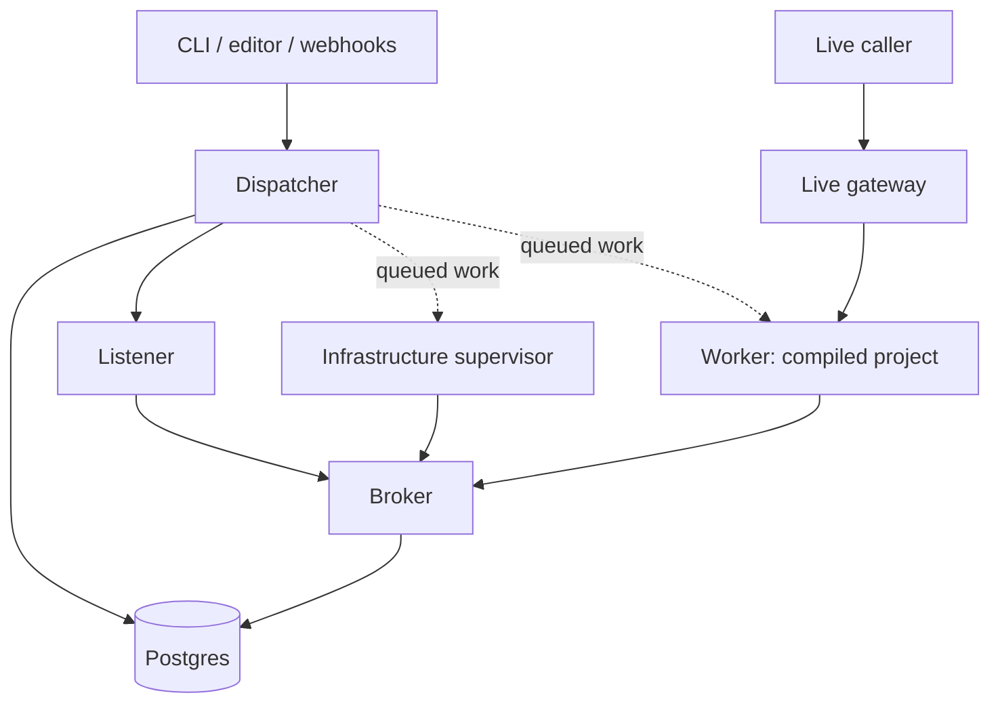

# How the runtime is built

Four kinds of process, one job each. The **worker** runs your program. The
**dispatcher** decides what runs where. **Listeners** wait for events. The
**supervisor** looks after any service your program asked for. Anything that
has to survive a crash goes into Postgres, and all four read it back from
there.

The dotted arrows are rows in a table, not calls. Workers and supervisors
claim that work through the broker.

## What happens when an event arrives

A listener holding a timer or a subscription reports the event through the
broker. The dispatcher works out which run it belongs to and makes sure a
worker exists.

The worker claims the job, fetches the project definition by its hash, and
runs the graph, writing what happens into [the journal](the-journal.md) as it
goes.

An HTTP or WebSocket caller takes a different road: it reaches the worker
through the live gateway, which holds the caller's connection open while the
program runs. For that, read [an HTTP endpoint](../start/on-a-url.md).

## Dispatcher

The dispatcher answers every request about a project or a run, and decides
which worker runs what and when workers start and stop. It writes tasks to the
database rather than calling any particular worker.

It never runs your step code. The CLI reads your local catalog and compiles
the program before submitting it, so the dispatcher never needs to see your
`nodes/` directory.

Anything shared lives in Postgres, because the next request may land on a
different dispatcher pod with nothing in memory.

## Listener

A listener holds the timers, the open sockets and the other event sources.
When something arrives, it turns that into a message the dispatcher knows how
to route. Listeners are the only tier that tells one kind of event source from
another, so a new kind of trigger is listener code and nothing else. They
never run your step code.

One listener pool serves every project on the installation, and each listener
reports how close it is to its memory limit, so weft knows where to put the
next event source.

## Infrastructure supervisor

The supervisor applies your infrastructure specs and watches whether what it
created is healthy. Before it issues any cluster command it takes a lease on
the project, and it keeps renewing that lease for as long as the work runs. If
the lease expires, another supervisor picks the project up.

A supervisor can still die between changing the cluster and recording that it
did, so the next one works out what to do from what the cluster actually looks
like rather than trusting the record. For what the verbs do, read
[infrastructure nodes](../nodes/infrastructure.md).

## Worker

A worker is one compiled project binary running as a pod, serving as many runs
at once as it can. When a project's workers get close to their memory limit,
weft adds another pod to the pool. Going the other way, a worker with nothing
left to claim shuts itself down after 30 seconds.

It caches every project definition it fetches, keyed by hash.

A suspension can leave a worker free to exit, though other live work or a held
caller keeps it up. For that difference, read [surviving a
restart](../nodes/durable-execution.md).

## Who is allowed to talk to what

The dispatcher and the broker talk to Postgres directly. Everything else goes
through the broker: listeners, supervisors and workers. The broker asks
Kubernetes to verify the caller's service-account token, then checks what that
particular service account is allowed to touch.

The broker also handles storage and connection work, including OAuth exchanges
and subscription setup. A worker calls the provider itself, so a slow provider
never queues up behind the broker.

Network policies limit where the broker can go, with explicit holes for
Postgres and the Kubernetes API. If your object store sits on a private range
those rules cannot work out, set `WEFT_STORE_ALLOW_CIDR` to it and the broker
gets a hole for exactly that.

The local management API has no authentication of its own, so whoever can
reach it can do anything a project owner can. Keep it off any interface you do
not control. For the rest of the boundaries, read the [security
policy](https://github.com/WeavemindAI/weft/blob/mvp/SECURITY.md).

## Recovery

Ownership records expire unless their holder keeps renewing them, so a
replacement can claim expired work without needing anything the dead pod had
in memory.

Journal writes carry the identity of the worker that made them, and the
database rejects writes from a worker whose registration has been removed,
which is what stops an evicted worker carrying on.

Recovery reads the saved events, and what it cannot recover is an external
action whose result never got written down. For that boundary, read [the
execution guarantee](the-journal.md#the-execution-guarantee).

## Swapping pieces out

If you are putting weft on something other than Kubernetes, these are the
seven traits you implement. Nothing else in the runtime changes:

| Interface | Decides |
|---|---|
| `Authenticator` | Which tenant a request belongs to |
| `TenantRouter` | Which tenant a project belongs to, outside a request |
| `PlacementPolicy` | Which namespace a worker goes in |
| `SandboxPolicy` | Which runtime class it gets |
| `WorkerBackend` | How worker pods get created |
| `ImageBuilder` | How staged source becomes a runnable image |
| `Journal` | Which store execution events are written to and read back from |
