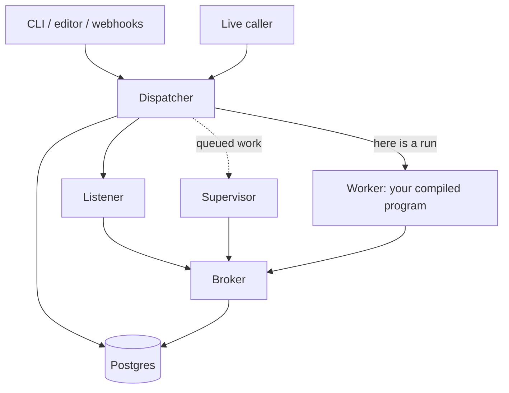

# How the runtime is built

The runtime has four roles, each with one job.

| | What it does | What it never does |
|---|---|---|
| **Worker** | Runs your compiled program | Touch Postgres: it goes through the broker |
| **Dispatcher** | Decides what runs, and answers every request about a project or a run | Run your step code |
| **Listener** | Holds the timers, the open sockets and the subscriptions | Run your step code, or know which project it serves |
| **Supervisor** | Creates and watches the machines and containers your program asked for | Run your step code, or change a project's infrastructure while another supervisor is changing it |

The dispatcher, listener and supervisor, together with the broker, are parts of one
binary, `weft-runtime`, and on your machine one `weft-runtime` process runs
all of them. On a cloud install each is a Cloud Run service of its own,
which scales with its own load and down to zero between calls. Triggers that
keep a connection open run separately, on holders: for how they work, see
[the listener](#the-listener), and for what they cost, see
[what you get](cloud.md#what-you-get). Workers are always
separate: one per program, started by the runtime.

Anything that has to survive a crash goes into Postgres, and every role reads
it back from there.

```mermaid
flowchart TD
    UI["CLI / editor / webhooks"] --> D["Dispatcher"]
    D --> L["Listener"]
    D -->|"here is a run"| W["Worker: your compiled program"]
    C["Live caller"] --> D
    D -.->|"queued work"| S["Supervisor"]
    D --> PG[("Postgres")]
    L --> B["Broker"]
    S --> B
    W --> B
    B --> PG
```

## How a run is handed out

Every run starts as a row in a table. The dispatcher writes the row, then
hands the run to one of the program's workers, and the worker claims the row
before it does anything. If the dispatcher dies after writing, the row is
still there, and the dispatcher hands it out the next time it checks for
waiting work. If a worker dies holding a run,
its claim runs out and the run is handed out again.

A claim lasts 60 seconds and the holder renews it every 15. Claiming is
`FOR UPDATE SKIP LOCKED`, so two workers never take the same run.
Every queued run also carries a key that turns a duplicate into a no-op, so work
queued twice runs once. A run whose claim ran out may be half done, and the next worker may redo
part of the runtime's own bookkeeping for it, which is why every step the
runtime takes has to be safe to run twice. Your nodes are different: a node
that was running when its worker died is failed, never run again (go and read
[surviving a restart](../nodes/durable-execution.md#when-the-worker-dies-mid-step)).

## What happens when an event arrives

When a timer fires or a subscription delivers something, the listener holding
it reports the event to the dispatcher. The dispatcher works out which run it
belongs to, writes it down, and hands it to
a worker, which fetches your program by its hash and runs the graph, writing
what happens into [the journal](the-journal.md) as it goes.

An HTTP or WebSocket caller calls the dispatcher at `/connect/...`. The
dispatcher checks the caller, starts their run and passes the call, in that
same request, to one of the program's workers, which claims the run and
drives it with the caller attached. The dispatcher stays in the middle,
passing bytes both ways, because workers are never reachable from outside.
A browser can't put a credential on a WebSocket's opening request, so a
browser asks with a plain request first and gets back an address under
`/live/<project>/...` carrying a signed ticket, which it opens its socket at.
For more, go and read [putting it on a URL](../build/public-address.md).

## The worker

A worker is one compiled program, serving as many runs at once as it can. It
runs from an image named after a hash of its contents, so two projects that compile to the same
thing share an image.

On your machine a worker is a Docker container, one per program and image,
started when a run needs it and stopped after five minutes with nothing to do.
On a cloud install it is a Cloud Run service, which scales to zero between
calls and out when calls pile up.

If you want to change how many copies stay warm, how many runs one copy serves
at once, or its CPU and memory, `weft workers` sets them for a project, on top
of the install's defaults. If a run may take longer than a Cloud Run request
allows (an hour), ask for a long run with `weft run --long`, or with
`longRuns` on its trigger, and it gets a worker of its own that lives until
the run ends (up to seven days on a cloud install).

## The dispatcher

It never sees your `nodes/` directory. Your CLI reads your local catalog and
compiles the program before submitting it, so the dispatcher only ever handles
a compiled definition.

The next request may land on another copy of the dispatcher, so it keeps
nothing in memory that another copy would need.

What it does keep is a copy of the rows a call reads every time and that
rarely change: a tenant's routes, the install's domains, a project's worker
settings, which of its infrastructure is up. Every write to those rows makes
Postgres tell every copy of the dispatcher, which drops what it held and reads
it again on the next call, and anything it is about to refuse (no such route,
infrastructure not running) it checks against the rows first. While its
connection that hears those announcements is down, it keeps nothing and reads
every time. So a live call
reaches the database once before the worker has it: one call that checks the
route's limits and writes the run down together.

## The listener

One listener serves every project on the install. Each kind of trigger says
what it needs between two events, and the listener does exactly that:

- **A form or a webhook** needs nothing: it is called from outside, and the
  listener only turns the call into a message.
- **A schedule, a delay or a poll** needs a timer. It asks for its next wake,
  and the install's alarm delivers it (a table in Postgres on your machine,
  Cloud Tasks on a cloud install), even across a restart of the runtime.
- **A stream or a socket** needs an open connection, so it needs a process
  that stays up between events. weft calls that process a holder, and it runs
  the listener's code. On
  your machine that is the runtime's one process. On a cloud install the
  holders run in a pool, as many as those connections need and none when
  there are none. Each holder claims the triggers it holds, so no two
  holders hold the same one, and it renews those claims every 10 seconds. If a holder crashes, its claims run
  out after 30 seconds and another holder takes its triggers. A holder that
  is shut down gives them up at once.
- **An event subscription** needs a holder only when it dials out to the
  service. On a cloud install, when the service can push the subscribed events
  for one account, weft subscribes with the service instead and renews that
  on a timer, so nothing stays open for it. A subscription to every account
  of your app always dials out.

If you want a new kind of trigger, you only write listener code: the listener
is the only role that tells kinds apart.

## The supervisor

It applies your infrastructure and watches whether what it created is
healthy. Each piece of infrastructure your program asks for (a database, a
model server) is a unit: on your machine a set of Docker containers, on a
cloud install a Compute Engine machine of its own, with its disks and GPUs.

Two supervisors changing the same project at once would overwrite each other,
so before it changes anything a supervisor takes an exclusive lease on the
project. It keeps renewing that lease while the work runs, and if it expires
another supervisor picks the project up.

A supervisor can still die between changing something and recording that it
did. The next one works out what to do from what is actually running, rather
than trusting the record.

## The broker, and who may talk to what

Only the dispatcher and the broker hold a database connection; the listener,
the supervisor and every worker go through the broker.

The broker checks every request. The caller proves who it is with a token its
platform gave it: on your machine, one the runtime signed when it started the
container; on a cloud install, one Google signed for the account the caller
runs as, weft's own or the program's. The broker works out from that token
whose install the caller belongs to and which role it plays, and it checks
that the caller may touch what it asked for. Your
program's worker runs untrusted node code, so it never gets a database
connection.

The broker also handles storage and connection work, including OAuth exchanges
and subscription setup. Your worker calls providers itself, so a slow provider
never holds up the broker for everyone else.

On your machine, the API the CLI talks to has no password: anything that can
reach it can do what a project owner can. It only answers programs on your own
machine (`127.0.0.1`). For the rest of the boundaries, go and read the
[security policy](https://github.com/WeaveMindAI/weft/blob/main/SECURITY.md).

## What happens when something dies

Journal writes name the worker that made them, and the broker refuses any
write from a worker that no longer holds the run's claim, so a worker that
lost its run cannot keep writing to it.

Recovery reads the saved events. What it cannot recover is an external action
whose result never got written down. For that boundary, go and read
[the execution guarantee](the-journal.md#the-execution-guarantee).

## Running it somewhere new

If you want weft on another platform, write a crate that implements the traits below, from
`crates/weft-platform-traits`: everything that depends on where weft
runs sits behind one of them.

| Interface | What it answers |
|---|---|
| `Runner` | How a program's workers are started and reached |
| `InfraHost` | Where infrastructure units run, and how they are watched |
| `ImageBuilder` | How staged source becomes a runnable image |
| `Alarm` | How a wake set for later is delivered |
| `CallerIdentity` | Who is calling an internal endpoint |
| `IdentityTokens` | How a role proves who it is to another |
| `FrontendHosting` | Where a project's frontend runs, when the install hosts it |
| `DomainHosting` | What stands in front of the install's own domains and holds their certificates |
| `HolderPool` | How many holders run, for the triggers that keep a connection open |

Files go through one more trait, `ObjectStore`. If your platform's store
speaks S3 and you can hand it a key pair, you implement nothing: the S3
client (`object_store_for`) talks to it, the way it talks to SeaweedFS on your
machine. GCP has its own (`GcsObjectStore`), because it reaches Cloud Storage
as the runtime's own service account and has Google sign the links, so no key
exists for an organization's policy to forbid.

Two platforms exist: `weft-platform-local` (Docker on your machine) and
`weft-platform-gcp` (Cloud Run, Compute Engine, Cloud Build, Cloud Tasks). The
install's config names one, and `crates/weft-runtime/src/platform.rs` is the
one place that reads which.
