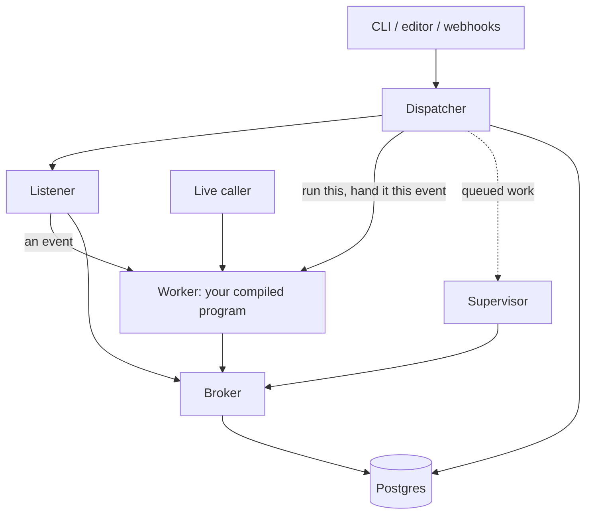

# How the runtime is built

The runtime has four roles, each with one job.

| | What it does | What it never does |
|---|---|---|
| **Worker** | Runs your compiled program | Touch Postgres: it goes through the broker |
| **Dispatcher** | Decides what runs, and answers every request about a project or a run | Run your step code |
| **Listener** | Holds the timers, the open sockets and the subscriptions | Run your step code, or know which project it serves |
| **Supervisor** | Creates and watches the machines and containers your program asked for | Run your step code, or change a project's infrastructure while another supervisor is changing it |

The dispatcher, listener and supervisor, together with the broker, are parts of one
binary, `weft-runtime`, and on your machine one `weft-runtime` process runs
all of them. On a cloud install each is a Cloud Run service of its own,
which scales with its own load and down to zero between calls. Triggers that
keep a connection open run separately, on holders: for how they work, see
[the listener](#the-listener), and for what they cost, see
[what you get](cloud.md#what-you-get). Workers are always
separate: one per program, started by the runtime.

Anything that has to survive a crash goes into Postgres, and every role reads
it back from there.

```mermaid
flowchart TD
    UI["CLI / editor / webhooks"] --> D["Dispatcher"]
    D --> L["Listener"]
    D -->|"run this, hand it this event"| W["Worker: your compiled program"]
    C["Live caller"] --> W
    L -->|"an event"| W
    D -.->|"queued work"| S["Supervisor"]
    D --> PG[("Postgres")]
    L --> B["Broker"]
    S --> B
    W --> B
    B --> PG
```

## Where a run lives

Whether a run survives its worker dying is set by its trigger's `durable` input,
or for a run you start by hand, by `weft run --durable` or `--fast`. For
what it does, go and read [how a run is
kept](../language/triggers-and-routes.md#how-a-run-is-kept), and for when each
kind of run waits for the database, [when a run waits for its
writes](the-journal.md#when-a-run-waits-for-its-writes).

Once a run has written anything, it has one row in the database, and the row
says where the run is: waiting for a worker, running on the worker it names,
parked on a wait with no worker, or ended.

When a trigger starts a run (a caller on a `Route` or a `Socket`, or an event
such as a timer, a subscription or a webhook), the run starts on the worker
that took the call or the event, and its row names that worker from its first
write. Every other run starts as a queued row: a run you start with
`weft run`, a paused run picking back up, a run another worker handed back,
and the setup runs that `weft activate` and `weft infra start` make. The
dispatcher hands a queued run to a worker, which claims it (the row names that
worker from then on) and carries it on from its record.

If a trigger starts a fast run and its worker dies straight away, the run may
never show up in `weft executions`, because a fast run's record trails a few
milliseconds behind it and may not have reached the database yet.

## Where a call goes

If a caller uses the project's own address, it reaches your program's worker
straight, with nothing of weft's in between. On your machine the worker running the project's current program
opens the project's own port itself, so `http://127.0.0.1:14200/cards` is the
worker answering. For how that port is picked, go and read [answering on a
URL](../language/triggers-and-routes.md#answering-on-a-url). On a cloud install
each project is a Cloud Run service of its own, open to every caller, and that
service's address is the project's address. A `weft domain add --for api`
domain sends its calls straight to that service. `weft activate` prints the
address, and `weft status` shows it. For how a browser opens a socket on a
route that checks callers, go and read [answering on a
socket](../language/triggers-and-routes.md#answering-on-a-socket).

The address an install shares between its projects (`/connect/local/...`,
the tunnel's hostname, the install's own domain) still works: the dispatcher
picks the project and the program by the route, from routes it holds in
memory, and passes the call on. It adds headers giving the caller's address and
the `Host` they sent, and the worker trusts those headers only
when the call carries weft's own key. The dispatcher checks nothing else
and writes nothing.

Once a call reaches the worker, the worker does the checking: which route the
call is for, whether its trigger is on, the instance it names and the route's
limits on how many calls it takes, and it asks the broker to check the route's
credentials when the route asks for one. The worker holds the project's routes
in memory, and the broker tells it the moment one changes. Unless the route
asks for a credential or the call carries an instance token (which names the
[instance](instances.md) the call is for), nothing reaches the database before
the run starts.

If a route's trigger is parked, hibernating within its grace window, or still
being set up, the worker answers `503` with a `Retry-After` at once, so a client that retries
gets through once the trigger is on. When a new version of the program
replaces the worker, on your machine the port stays closed while the old
worker hands its runs back or ends them (10 seconds at most, then it is
killed) and the new one starts. A caller
arriving then is refused, as with any server restarting.

If a route still belongs to another version of the program than the one at
the project's address (a new version is taking over), the call gets the same
`503` and `Retry-After`, and lands on the new version once it holds the
route.

## What happens when an event arrives

When a timer fires or a subscription delivers something, the listener holding
it hands the event straight to the worker of its project, through the same
door callers use: the worker checks whether the trigger takes work now and
the trigger's limits, and works out what the run reads. If the trigger is
parked, it is past its limits, or what the run reads is not ready (its
infrastructure is down, its instance has not given a value it needs), the
event waits in the trigger's queue, and the dispatcher hands it over again
once it can run. Otherwise the
worker starts the run as a fast or durable run, whichever its trigger asks
for, and writes what happens into [the journal](the-journal.md) as it goes.

A webhook or a provider's push arrives at the install's own address: the
dispatcher has the listener read it, then hands it to the worker the same
way. An answer to a run that waits (a form, a person's reply) goes through
the dispatcher, which resumes that run. When the listener cannot reach the
worker (the project has no address now, the call fails or goes unanswered),
the event waits in the trigger's queue the same way.

Whoever handed the event over keeps its call to the worker open until the
run ends, so the platform counts the run as work: Cloud Run keeps giving the
worker CPU, and a local install does not stop it as idle.

## The worker

A worker is one compiled program, serving many runs at once. It runs from an
image named after a hash of its contents, so two projects that compile to the
same thing share an image.

On your machine a worker is a Docker container, one per project and build of its program;
changing the project's worker settings (`weft workers set`) starts a fresh one
for the calls that follow. The one at the project's address runs for as long
as any of the project's triggers takes work. Any other starts when a run needs
it and stops after thirty seconds with nothing to do, unless the project keeps
copies warm with `weft workers set --min-instances`. To change the thirty seconds, set
`platform.workerIdleStopSeconds` in the install's `config.json`
(`~/.local/share/weft/config.json`) and restart the daemon.

On a cloud install a worker is a Cloud Run service. Cloud Run starts more
copies of it when calls pile up and removes idle ones when it decides to,
down to none, so a project nobody calls costs nothing. If you keep copies
warm with `--min-instances`, those are billed even while idle. If you want to
change how many calls Cloud Run sends one copy at once (`--concurrency`), the most
copies Cloud Run may start (`--max-instances`), or a copy's CPU and memory
(`--cpu`, `--memory`), `weft workers set` changes them for one project. On
your machine none of these four does anything: there is no Cloud Run sending
calls or starting copies, and weft puts no CPU or memory limit on a worker.

On a cloud install, if a run keeps working after its caller has gone (a Route
with `outlivesCaller` that replies and carries on), the steps it was running
when the caller left finish on that copy, and the rest of the run moves under
a call weft holds open (for how, go and read [how a run is
kept](../language/triggers-and-routes.md#how-a-run-is-kept)). Cloud Run
throttles the CPU the moment the answer goes out, so if those last steps are
heavy, turn on `weft workers set --cpu-always-allocated true`. With it, the
copy is billed for as long as it is up.

A thing a worker's runs share (`ctx.shared`, such as a pool of database
connections) lives in the worker too: it goes once no run has used it for
five minutes (`weft workers set --shared-idle-seconds` changes that), and at
the latest when the worker stops. For how a node asks for one,
go and read [the ctx](../nodes/ctx.md#sharing-something-between-runs).

A worker keeps, between runs, what its runs read of the program's
infrastructure and connections: where each piece answers, the connections the
broker handed it, and the ones an infrastructure node published. That rarely
changes between runs, so after the first run a call no longer asks the broker
where things answer or for its connections, and starts its run straight away.
Whenever one of those changes (a piece restarts somewhere else, a connection
is replaced), the broker tells the worker, which drops what it kept and asks
again. Two exceptions: a credential weft hands to a single run is never kept, and a
credential that expires is kept only until it is due a refresh.

If a run may need more than an hour on a cloud install, go and read [how a
run is kept](../language/triggers-and-routes.md#how-a-run-is-kept).

## When a worker is full

A worker takes a set number of calls and events at once. Unless you set it,
that is one for every MiB of the worker's memory (on your machine, the
machine's), and never fewer than 64. If you want another number for a project, `weft workers set
--max-runs-at-once` sets it. A run handed to the worker from the queue (a `weft
run`, a resume) is not counted.

If a call arrives while the worker is full, it waits up to 30 seconds
(`--max-queue-wait-seconds`) for a run to end, before any of its body is read.
At most as many calls can wait as the worker takes at once. A call that waited the whole time, or found no room to wait,
gets a `503` saying `This worker is busy right now; try again in a moment.`,
with a `Retry-After`. An event waits the same way, and one that waited too
long goes in its trigger's queue, where it waits until a worker has room for
it.

If the database falls behind, runs take longer to end (for why, go and read
[when a run waits for its writes](the-journal.md#when-a-run-waits-for-its-writes)),
the calls queued behind them wait longer, and one that waits past
`--max-queue-wait-seconds` gets the same `503`.

The same `503` comes back while memory is more than 90% full, because one run
too many would get the whole worker killed, and every run on it with it. On a
cloud install that is the copy's own memory; on your machine it is the
machine's, whatever is using it. The runs already on the worker carry on. If
you see it often on a cloud install, lower `--max-runs-at-once`. Cloud Run
never sends one copy more than `--concurrency` calls at once (80 unless you
change it), so a lower `--max-runs-at-once` only helps if it is below that. You
can also lower `--concurrency` itself, or give each copy more memory with
`weft workers set --memory`. On your machine, free some memory or lower
`--max-runs-at-once`.

## The dispatcher

It never sees your `nodes/` directory. Your CLI reads your local catalog and
compiles the program before submitting it, so the dispatcher only ever handles
a compiled definition.

The next request may land on another copy of the dispatcher, so it keeps
nothing in memory that another copy would need.

What it does keep is a copy of the rows a call reads every time and that
rarely change: a tenant's routes, the install's domains, a project's worker
settings, which of its infrastructure is up, the connections the install
picked for it and what each instance provides. Every write to those rows makes
Postgres tell every copy of the dispatcher, which drops what it held and reads
it again on the next call, and anything it is about to refuse (no such route,
infrastructure not running) it checks against the rows first. While its
connection that hears those announcements is down, it keeps nothing and reads
every time.

The dispatcher's background work (handing runs to workers, answering what a
program asks of weft, registering triggers) waits on rows in the database, and
Postgres announces each one as it is written. A dispatcher that is up hears
that and starts at once, on your machine and on a cloud install alike. On a
cloud install, where the dispatcher can be at zero, whichever part of weft
wrote the work also calls it to start one.

If you are watching a run in the editor, or waiting on one to end, you hear
about it roughly 10 milliseconds after its rows are written. The broker gathers
which runs got rows and which ended, and tells the dispatcher in one statement
once the write has committed. It announces after the write rather than inside
it, because Postgres makes every write that announces something commit one at
a time, so announcing from inside each write would
line up every write in the database behind the others.

Some endings leave the dispatcher work (finishing a trigger's setup, clearing a
run's pending waits). If it crashes or loses its Postgres connection it can
miss such an ending, but it finds the work anyway: it looks when it starts, when the connection comes back, and every 30 seconds while it is up.
On a cloud install where it sat at zero, it also looks within six hours at the
latest.

## The listener

One listener serves every project on the install. Each kind of trigger says
what it needs between two events, and the listener does exactly that:

- **A form or a webhook** needs nothing: it is called from outside, and the
  listener only turns the call into a message.
- **A schedule, a delay or a poll** needs a timer. It asks for its next wake,
  and the install's alarm delivers it (a table in Postgres on your machine,
  Cloud Tasks on a cloud install), even across a restart of the runtime.
- **A stream or a socket** needs an open connection, so it needs a process
  that stays up between events. weft calls that process a holder, and it runs
  the listener's code. On
  your machine that is the runtime's one process. On a cloud install the
  holders run in a pool, as many as those connections need and none when
  there are none. Each holder claims the triggers it holds, so no two
  holders hold the same one, and it renews those claims every 10 seconds. If a holder crashes, its claims run
  out after 30 seconds and another holder takes its triggers. A holder that
  is shut down gives them up at once.
- **An event subscription** needs a holder only when it dials out to the
  service. On a cloud install, when the service can push the subscribed events
  for one account, weft subscribes with the service instead and renews that
  on a timer, so nothing stays open for it. A subscription to every account
  of your app always dials out.

If you want a new kind of trigger, you only write listener code: the listener
is the only role that tells kinds apart.

## The supervisor

It applies your infrastructure and watches whether what it created is
healthy. Each piece of infrastructure your program asks for (a database, a
model server) is a unit: on your machine a set of Docker containers, on a
cloud install a Compute Engine machine of its own, with its disks and GPUs.

Two supervisors changing the same project at once would overwrite each other,
so before it changes anything a supervisor takes an exclusive lease on the
project. It keeps renewing that lease while the work runs, and if it expires
another supervisor picks the project up.

Inside the one supervisor that holds a project, the work on different copies
runs side by side: three instances started together come up together. Work on
the same copy runs in the order it was asked for, so a stop asked after a start
waits for that start.

A supervisor can still die between changing something and recording that it
did. The next one works out what to do from what is actually running, rather
than trusting the record.

On your machine the supervisor looks at the health of what it runs every
thirty seconds. On a cloud install nothing looks while everything is fine, so
infrastructure that runs fine costs no look at all and lets the rest of the
install sleep: the agent on each machine watches its unit right there, for
free, and asks for a look when how the unit stands changes (a container
stopped, a check started failing or passing again), and Compute Engine's own
record of a machine stopping or failing asks too. Once something is not fine,
the supervisor keeps looking until it is settled, which is what its flaky and
recovery windows need.

## The broker, and who may talk to what

Only the dispatcher and the broker hold a database connection; the listener,
the supervisor and every worker go through the broker.

Each of those processes keeps one WebSocket open to the broker, and every call
it makes rides that one connection, numbered and answered in whatever order
they finish. A call the broker holds until something happens (new journal
rows) costs nothing while it waits, so a worker takes one seat at the broker
however many calls its runs hold open, and a call whose caller stops waiting
is dropped at the broker too. The broker also pushes down the same connection
the changes a worker keeps a copy of (see [the worker](#the-worker)), and the
cancel of a run the worker drives. A connection with nothing to do for a
minute closes, and opens again on the next call, so an idle process holds
nothing open at the broker, except a worker. A worker driving runs keeps its
connection open, to hear their cancels, and an idle one reports to the broker
every second (that it is alive, and how many runs it drives), so its
connection opens again within a second of closing. When the connection breaks, it comes back by
itself: a call not yet sent goes out on the new one if it is back within the
call's wait. Past that, or when a sent call got no answer, two kinds of call
are made again because doing so is safe: a batch of records (a batch that
arrives twice is stored only once), and a read of a run's history. A call the broker says it could not even start
(every one of its database connections busy) is sent again too, since nothing
of it ran. Any other call fails the way a request whose connection reset
does, since it may have landed. Uploads and downloads of files stay ordinary
requests, so a big file never holds up the calls behind it.

The broker checks every request. The caller proves who it is with a token its
platform gave it: on your machine, one the runtime signed when it started the
container; on a cloud install, one Google signed for the account the caller
runs as, weft's own or the program's. The broker works out from that token
whose install the caller belongs to and which role it plays, and it checks
that the caller may touch what it asked for. Your
program's worker runs untrusted node code, so it never gets a database
connection.

The broker also handles storage and connection work, including OAuth exchanges
and subscription setup. Your worker calls providers itself, so a slow provider
never holds up the broker for everyone else.

On your machine, the API the CLI talks to has no password: anything that can
reach it can do what a project owner can. It only answers programs on your own
machine (`127.0.0.1`). For the rest of the boundaries, go and read the
[security policy](https://github.com/WeaveMindAI/weft/blob/main/SECURITY.md).

## What happens when something dies

A worker that dies takes its fast runs with it. The exception is a run whose
every branch is waiting on a timer or a form: its whole record is written
before it pauses, so a new worker picks it up when the wait ends. That
exception does not hold while a caller is still on the line and the route
leaves `outlivesCaller` off, or while a bus between its nodes is open: such a
run holds its worker instead of pausing. Nobody can
tell which of a fast run's steps ran after the last row that reached the
database, and running it again could repeat them, so a fast run whose worker
died ends cancelled and is not run again, with this reason: `the worker running this run went away; a fast run lives in its
worker's memory, so it is not run again (make its trigger durable for a run
that survives its worker)`.

A lost fast run is not marked cancelled the moment its worker dies: the
dispatcher notices and ends it. Every worker reports that it is alive through
the broker once a second, and counts as gone 15 seconds after its last report.
The dispatcher ends a run once its worker has been gone for another 15
seconds, and it checks every 15 seconds, so a fast run ends 30 to 45 seconds
after its worker last reported. Its journal holds what reached the database
before the worker died.

In that same check, a durable run whose worker died is queued again, and the
dispatcher hands it to another worker at once, which carries it on from its
record. A step that had started but not finished is failed on the new worker
rather than run again, apart from some steps of pure nodes. For which ones,
and what to do about a failed step, go and read [surviving a
restart](../nodes/durable-execution.md#when-the-worker-dies-mid-step).

On a cloud install, when Cloud Run replaces a worker or scales one away, it
sends the worker `SIGTERM`, the signal that asks a process to stop on its own,
and kills it 10 seconds later. Every run on the worker then leaves it if it
can:

- A run that can pause starts no new step. Once the steps it is running have
  ended, its record is written whole and it is handed back, so another worker
  carries it on straight away. A step still running 5 seconds after the
  `SIGTERM` is stopped where it is, and the next worker fails that step, the
  same as if the worker had died. If its caller is still on the line (a route
  with `outlivesCaller` on), the run carries on with nobody there, and the
  caller hears `the copy of the program serving this request is stopping, so
  the run carries on in another one without this caller`.
- Three kinds of run cannot pause: an unrecorded run, a run tied to the caller
  still on the line (a route without `outlivesCaller`), and a run with a bus
  open, since a bus lives in its worker's memory alone. Each keeps running,
  starting new steps as usual, until the platform stops the process. If it has
  not ended by then, that is the same as its worker dying: a fast run ends
  cancelled, and a durable one is carried on by another worker. An unrecorded
  run that nothing had written down yet leaves no trace.

At the same moment the worker stops accepting connections. A call that was
already in, but whose run had not started yet, gets a `503` saying `this copy
of the program is stopping; try again in a moment`, so the client can retry
and reach another copy.

If you restart the daemon on your own machine, the new daemon sends the same
`SIGTERM` to every worker the old one left running and removes each once it
has exited, so their runs go the same way. When the new daemon sets up a
project's own address again, it kills that project's old workers 10 seconds
after sending them `SIGTERM`, so the new worker can open its port.
If you would rather not wait for an old worker to exit, `docker rm
--force <container>` stops it now, and the runs still on it end as if it had
died; the daemon's log (`~/.local/share/weft/runtime.log`) names each such
container.

If a worker cannot get a batch of records written (the broker errors or never
answers), the runs in that batch end failed (for why, go and read [why a
failed write stops the run](the-journal.md#why-a-failed-write-stops-the-run)).

If a worker freezes or loses its connection to the broker, it stops reporting,
and its runs go the way a dead worker's do: 30 to 45 seconds later a durable
run moves to another worker and a fast run ends. The run's row carries a
number that goes up every time a worker takes the run or loses it, and the
broker refuses any write made under another number. So from then on the frozen worker's writes to that run
are refused, and it drops the run.

## Running it somewhere new

If you want weft on another platform, write a crate that implements the traits below, from
`crates/weft-platform-traits`: everything that depends on where weft
runs sits behind one of them.

| Interface | What it answers |
|---|---|
| `Runner` | How a program's workers are started and reached |
| `InfraHost` | Where infrastructure units run, and how they are watched |
| `ImageBuilder` | How staged source becomes a runnable image |
| `Alarm` | How a wake set for later is delivered |
| `CallerIdentity` | Who is calling an internal endpoint |
| `IdentityTokens` | How a role proves who it is to another |
| `FrontendHosting` | Where a project's frontend runs, when the install hosts it |
| `DomainHosting` | What stands in front of the install's own domains and holds their certificates |
| `HolderPool` | How many holders run, for the triggers that keep a connection open |

Files go through one more trait, `ObjectStore`. If your platform's store
speaks S3 and you can hand it a key pair, you implement nothing: the S3
client (`object_store_for`) talks to it, the way it talks to SeaweedFS on your
machine. GCP has its own (`GcsObjectStore`), because it reaches Cloud Storage
as the runtime's own service account and has Google sign the links, so no key
exists for an organization's policy to forbid.

Two platforms exist: `weft-platform-local` (Docker on your machine) and
`weft-platform-gcp` (Cloud Run, Compute Engine, Cloud Build, Cloud Tasks). The
install's config names one, and `crates/weft-runtime/src/platform.rs` is the
one place that reads which.
