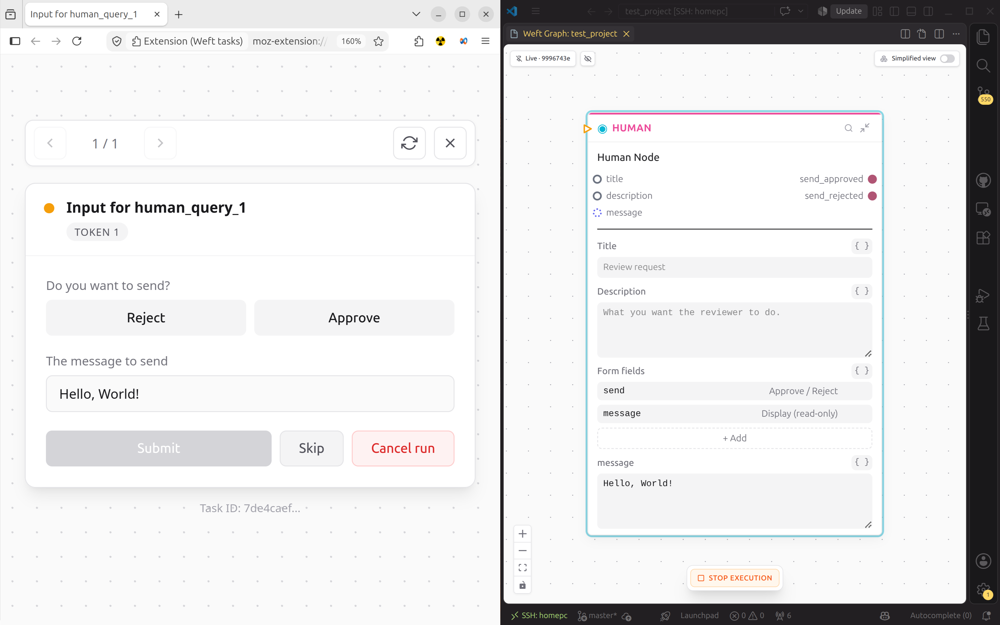

# Putting a person in the loop

Some steps belong to a human: an approval, or a correction the model should not
make alone.

Getting a program to wait for one is normally the expensive part, because
something has to remember where the flow was and wake it up again without
losing anything, which usually means a queue, a webhook and a state machine.

In weft it is a node.

```weft
review = HumanQuery {
  title: "Escalate this ticket?"
  fields: [{ "kind": "approve_reject", "key": "escalate" }]
}
```

Wire something into it, wire its outputs onward, and run. The execution
reaches `review`, suspends, and the worker process **exits** rather than
blocking.

The task appears wherever a person can answer it. When they do, a fresh worker
starts, rebuilds the execution's state from the journal, and continues from
exactly the point it stopped. That gap can be four seconds or four weeks; the
code is identical and so is the cost, which is one row in a table.

## The ports come from the form

`HumanQuery` has no fixed output ports. Its ports are derived from the fields
you configured, at compile time.

The `approve_reject` field keyed `escalate` produces two Boolean outputs:

- `review.escalate_approved`
- `review.escalate_rejected`

You never declare those. Add a `text_input` field keyed `reason` and you get a
`review.reason` String output alongside them. Change the form and the ports
change with it, and every wire you had is re-checked against the new shape.

So this compiles or it does not:

```weft
alert = SlackSendMessage {
  _should_flow: review.escalate_approved
  channel: "#oncall"
  text: classify.response
}
```

`_should_flow` is on every node and decides whether it runs. A `false` there
skips the node, which closes its outputs, which skips everything behind it, so
rejecting the escalation ends that branch on the spot. That is how branching
works here, and it is covered properly in
[How a weft program runs](../language/mental-model.md).

## Where the task shows up

Tasks reach people through the weft browser extension. Build it with:

```bash
./setup.sh --browser --no-sign
```

`--no-sign` skips signing the add-on with Mozilla, which you do not need for a
local install and which fails without AMO API keys.

Load the unpacked build, then connect it to your runtime with a token:

```bash
weft token mint --name "my laptop"
```

That prints a connect URL (and the bare token on a second line) exactly once,
because the server stores only a hash of it. Paste it into the extension and pending tasks start arriving.

A token can also be narrowed to one project or one kind of task, which is how
you hand a reviewer something that only ever shows them their own queue. That,
and the per-browser loading steps, are in
[The browser extension](../running/browser-extension.md).



<!-- IMAGE ------------------------------------------------------------------
file:  docs/src/img/extension-task.png
kind:  screenshot, ideally a two-panel composite
brief: Left: the weft browser extension popup showing one pending task, with
       the title "Escalate this ticket?", the LLM's classification text as
       context, and Approve / Reject buttons. Right: the VS Code graph view
       of the same execution with the HumanQuery node visibly in its
       suspended/waiting state and everything downstream of it still idle.
       The point is that both sides of the handoff are visible at once.
--------------------------------------------------------------------------- -->

## Watch the handoff

Run the program with the graph open. The `HumanQuery` node goes into its
waiting state and stays there. Answer in the extension and the graph continues
in front of you.

Answer it tomorrow instead and you get the same result, because the execution
is rows in a table rather than a process holding state.
[The journal](../running/the-journal.md) covers what those rows contain.

Next: [when something goes wrong](troubleshooting.md).
