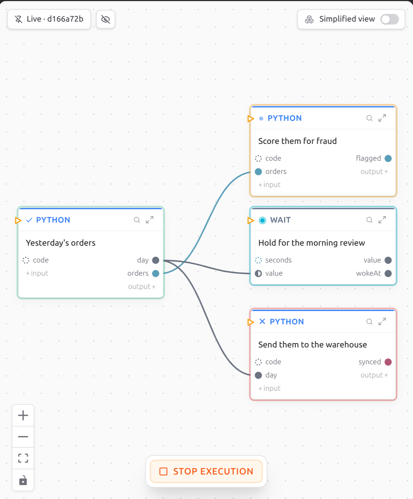

# Your first program

Making a project takes one command, and it has one choice in it: which AI
assistant you use. Pass `--assistant` with your row from this table and weft
copies Tangle into the project. Tangle is a persona that teaches your assistant
the language, and it reads the catalog on your disk rather than trusting what
it remembers.

| You use | Pass |
|---|---|
| Claude Code | `--assistant claude-code`, or `cc` |
| Kilo Code | `--assistant kilo-code`, or `kc` |
| Cursor | `--assistant cursor`, or `cu` |
| Codex | `--assistant codex`, or `cx` |
| GitHub Copilot | `--assistant github-copilot`, or `gh` |
| Gemini CLI | `--assistant gemini-cli`, or `gc` |
| Cline | `--assistant cline`, or `cl` |
| OpenCode | `--assistant opencode`, or `oc` |
| Devin Desktop | `--assistant devin-desktop`, or `dd` |
| Junie | `--assistant junie`, or `ju` |
| Something else | `--assistant agents`, which writes a plain `AGENTS.md` |
| Nothing | `--assistant none` |

If you use more than one, pass `--assistant` once for each. Whichever you pick
is remembered, so your next `weft new` installs the same one with no flag.

```bash
weft new hello --assistant claude-code
cd hello
weft run
```

It prints the project's id, then the run's id, then a timestamped line for
every step as it starts and finishes, then a tick:

```text
registered hello (3f2a1c4e-9b81-4d0a-8e55-7c2f1a6b30de)
started color 9b81d0a2-4e17-4a33-bc90-51d8e2f4a7c1 on version a1b2c3d
→ started color=9b81d0a2 entry=greeting
  …
✓ completed color=9b81d0a2
```

That long id after `started color` is the run's **color**, and it is how you
point at this one run later. Everything that reads a run takes it, and the
first eight characters are enough as long as they name only one.

If `weft` is not found, open a new terminal; the installer's `PATH` line only
takes effect in a fresh one. If the run stops saying it cannot reach the
runtime, run `weft daemon status` and go back to [Install](install.md).

## See it as a graph

Open the `hello` folder in VS Code, click the **Weft** icon in the bar down the
left edge, and click your project under **Projects**. The source opens on the
left and the graph opens beside it. (If you opened `src/main.weft` yourself,
click **Open Graph to the Side** in the file's title bar.)

Type in either pane and the other updates.


This is what `weft new` wrote, and what you just ran:

```weft
greeting = Text { value: "Hello, World!" }
out = Debug { data: greeting.value }
```

Two boxes and an arrow. A box is one step, which weft calls a **node**. The
dots down its left edge are what it takes in, the dots down its right edge are
what it sends out, and each dot is coloured by the kind of value it carries, so
two dots of the same colour fit together.

The arrow is `greeting.value` sitting where `out`'s `data` input goes. Writing
a source and a port where a value belongs is how you connect two steps, and it
is the only wiring syntax there is.

While a run is going, each box glows: amber while it works, cyan while it waits
for something, green when it finished, red when it failed. Click the magnifying
glass on a box to see exactly what went in and what came out.



For adding a box and drawing an arrow yourself, go and read
[working in the graph](../build/the-graph.md).

## What `weft new` made

| File or directory | What it is |
|---|---|
| `src/main.weft` | The program |
| `weft.toml` | Its name and its permanent id |
| `nodes/base_catalog/` | Every step weft ships, copied in so the build never reaches outside your project. `weft catalog update` replaces this folder wholesale after you update weft, so keep nothing of your own in here |
| `nodes/` (anywhere else) | Steps you write yourself |
| `CLAUDE.md`, `.claude/` | Tangle, for whichever assistant you picked |
| `.weft/` | Build state, generated |

Two more folders turn up later rather than now: `layouts/`, the first time you
drag a box, and `assets/`, when something needs a prompt or a script kept in a
file of its own.

`weft new` also runs `git init` and writes a `.gitignore`. Tangle's files are
ordinary project files, so they commit with the rest and anyone who clones your
project gets Tangle without installing weft.

Next, [the three lifecycles](lifecycles.md): what starts on its own and what
does not.
