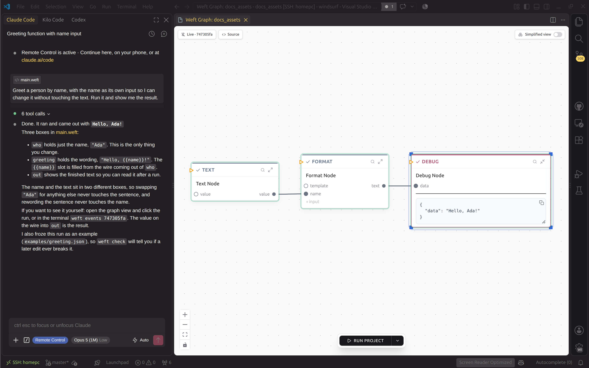

# Your first program

Make a project and run it:

```bash
weft new hello --assistant claude-code
cd hello
weft run
```

That flag installs Tangle, weft's persona for your AI assistant. With it you
can ask for changes to the program in plain English and it already knows how
weft works. If you use Kilo Code, write `--assistant kilo-code` instead. If you
use neither, run `weft new hello --assistant none` and skip the Tangle step
below; this page shows you two other ways to make the same change.

If `weft run` says it cannot reach the runtime, start it with
`weft daemon start` and try again.

The terminal prints `registered hello` and the project id, then `started color`
and a long id, then a couple of lines for each box as it starts and finishes,
and finally `✓ completed color=` with the first eight characters of that same
id. weft calls that id a **color**. It is how you point at one particular run
later on.

## See the program as a graph

Open the `hello` folder in VS Code and open `main.weft`. You get the graph: two
boxes and an arrow. If you already had the file open as text, that tab closes
when the graph opens.

The **Source** button at the top left of the canvas puts the text back, beside
the graph:

```weft
greeting = Text { value: "hello world" }
out = Debug

out.data = greeting.value
```

`greeting` and `out` are just names, and you can change them to anything.
`Text` and `Debug` say what kind of step each one is. The last line is the
arrow: read it right to left, so `out.data` gets `greeting.value`.

## Change it

Now say you want it to greet a person by name.

The step for this is `Format`. It fills in a template: you write `{{name}}`
where a value should go, and you give the box an input with that same name for
the value to arrive on. Every placeholder needs its input and every input needs
its placeholder. If one is missing, the step fails and tells you which.

There are three ways to do it. Pick one.

### Ask Tangle

Open the project in your assistant and tell it:

> Greet a person by name, with the name as its own input so I can change it
> without touching the text. Run it and show me the result.

It will make the change and run it for you.



That is what you get: three boxes, and the last one showing
`"data": "Hello, Ada!"`. The name sits in its own box, so you can swap `"Ada"`
for anything else without touching the sentence. Tangle picked its own names
for the boxes here, so yours may read differently.

### Build it in the graph

Press `Ctrl+P`, type `Format`, and pick it. Double-click the new box's title
and rename it to `sentence`.

A new `Format` box arrives with one input, `template`. The value you want to
drop into the sentence needs an input of its own, so make that first.
Underneath the box's inputs there is a small **+ input** button: click it, type
`name`, and press Enter.

Now right-click that new `name` dot. A menu opens with a row reading
`✎ Type: MustOverride`. Click it and the row turns into a text box with
`MustOverride` already selected, so type `String` over it and press Enter.
`MustOverride` is weft's way of saying nobody has decided this type yet, and
the build stops until you do.

Click the box open. Its body has a **Template** field: click that and type
`Hello, {{name}}!`.

Now the wires. Drag from the `value` dot on the right of `greeting` to the
`name` dot you just made, then from the `text` dot on the right of `sentence`
to `data` on `out`.

One thing left: `greeting` still holds `hello world`. Click it open and change
that to `Ada`. Then click the empty canvas, so the box is no longer being typed
into, and press `Ctrl+Enter` to run.

### Write it

Click **Source** and replace the file with this:

```weft
greeting = Text { value: "Ada" }

sentence = Format(name: String) {
  template: "Hello, {{name}}!"
  name: greeting.value
}

out = Debug
out.data = sentence.text
```

## See what each box received

Once it has run, a small magnifying glass appears in the top right of every
box. Click the one on `sentence` and a panel shows what went in, the template
along with `"name": "Ada"`, and what came out: `"Hello, Ada!"`.

Change `Ada` to another name and run again.

## What is in the folder

| File or directory | What you would go in there for |
|---|---|
| `main.weft` | The program |
| `weft.toml` | The project's name and its permanent id |
| `nodes/` | The code for every kind of step it can use |
| `CLAUDE.md`, `.claude/` (or `kilo.json`, `.kilo/`) | Tangle's instructions, for whichever assistant you picked. These are links into your weft checkout rather than copies, so updates reach every project at once. |
| `layouts/` | Where you dragged the boxes. It turns up the first time you move one. |
| `.weft/` | Build files, generated |

`weft new` also starts a git repository and writes a `.gitignore` for you.

If you write a step of your own, put it anywhere under `nodes/` except
`base_catalog/`. That folder holds the standard steps, and
`weft catalog update` throws it away and copies fresh ones in, taking anything
you left there with it.

If you want a step that does something new, check first whether one already
exists. `weft describe-nodes --list` prints every step in the project, one line
each. Once a name looks promising, `weft describe-nodes --node Text --compact`
prints what that one takes in and gives back.

## Where to go next

Ask for what you want, look at what came out, then say what is wrong with it.
That is most of building in weft.

So if you already have something you want to build, go and ask for it now. Ask
for one small piece at a time and run it against a real input before you ask
for the next. For a whole chapter on doing that, go and read
[Sequential Diffusion Programming](../thinking/sdp.md).

If you would rather keep reading, go and read
[Reading and building the graph](reading-the-graph.md) next. It covers what
every shape on the canvas means and how to wire them together.
