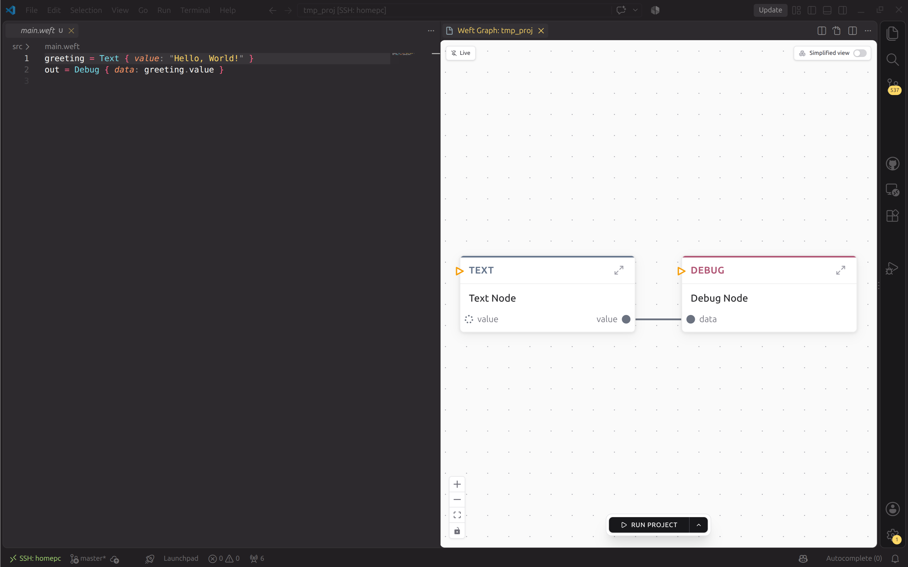
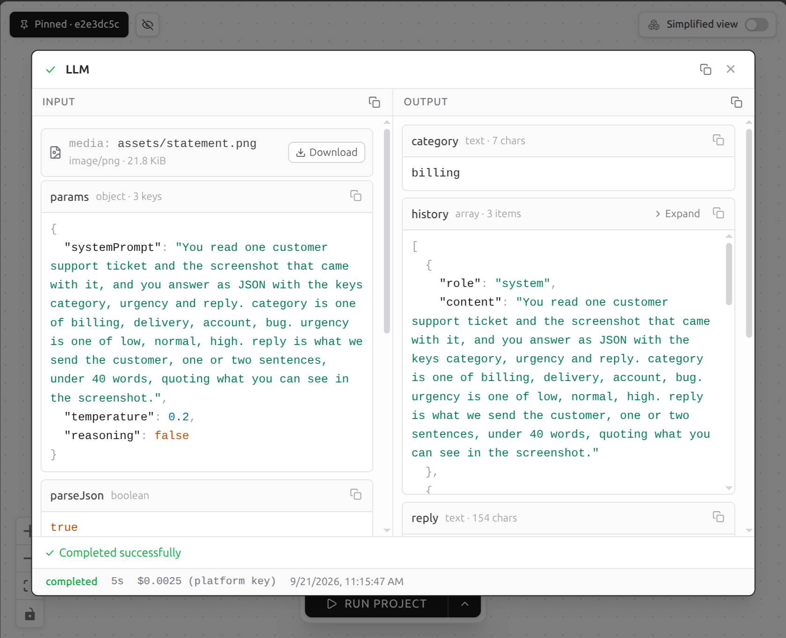
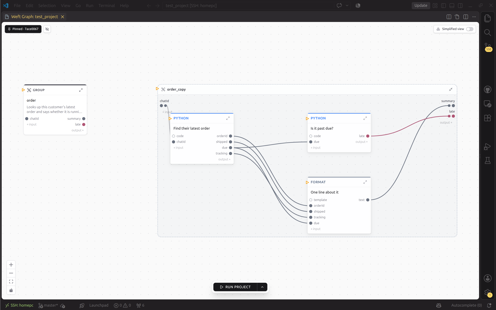

# Reading the graph

Open the project folder in VS Code. Open `main.weft`. The graph appears beside
the code.



<!-- IMAGE ------------------------------------------------------------------
file:  docs/src/img/graph-split-view.png
kind:  screenshot
brief: VS Code split view. Left pane: main.weft with the three-node
       greeting/shout/out program from the previous page, syntax highlighted.
       Right pane: the Weft graph webview showing the same three nodes as
       rounded boxes connected left to right, each with its icon, label, and
       named ports on the edge rails. Dark theme. No panels open, no
       execution running: this is the resting state.
--------------------------------------------------------------------------- -->

It is the same program, not a visualization generated from the code. The file
and the picture are two views of one thing, and edits in either direction go
through the compiler, so they cannot drift.

## Two directions, one source of truth

Type in the file and the graph redraws on save.

Drag a node, edit a field, connect two ports with the mouse, and the editor
does not touch the text itself. It sends a structured edit to the compiler,
which rewrites the source and hands back the new text. That is why your
comments and formatting survive a GUI edit: the parser keeps every byte of the
original, and the editor only ever asks it to change one thing.

Node positions are the exception. They live in a `layouts/` tree at the project
root that mirrors your source paths, rather than in the `.weft` file, because
where a box sits on a canvas is not part of what the program does.

A dotted wire with a label like `.stats.wpm` at its end is a wire that reads
one key off the value it carries, the graph form of
`speed.wpm = reader.profile.stats.wpm`. Right-click a wire to pick a key, one
level at a time, or to go back to reading the whole value.

## The square in the top-left corner

Every box, node or group, has a small square on its top-left edge, apart from
its own inputs. That is `_should_flow`, the port that decides whether the box
runs at all. It is filled in when something answers it and hollow when nothing
does. For what counts as a no, go and read
[How a weft program runs](../language/mental-model.md).

## Watching it run

Hit run from the editor, or `weft run` in the terminal with the graph open.


<!-- IMAGE ------------------------------------------------------------------
file:  docs/src/img/graph-mid-run.png
kind:  gif (about 6 seconds, looping) or screenshot
brief: The same three-node graph, mid-execution. The first node has already
       completed (settled/dim state), the middle ExecPython node is lit as
       currently running with its pulse animation on the incoming edge, the
       third node is still idle. If a gif: show the pulse travelling along
       each wire in turn and each node lighting as it fires, ending with all
       three settled. The value on the edge should be legible.
--------------------------------------------------------------------------- -->

Each node lights as it fires. Click one and the inspector opens on the exact
values that went in and came out of that firing.

You will spend most of your time in this loop: run it, click the step that
looks wrong, read the real value, fix that step, run it again. You are never
guessing what the data looks like at step four, because step four is one click
away and it is holding the value.



<!-- IMAGE ------------------------------------------------------------------
file:  docs/src/img/graph-inspector.png
kind:  screenshot
brief: The graph with one node selected and the execution inspector panel
       open. The panel shows that firing's inputs and outputs as formatted
       JSON with the port names, plus the node's status and timing. Pick a
       node whose value is interesting to look at, e.g. an LLM response or a
       parsed email body, so the panel is showing real content rather than
       "hello world".
--------------------------------------------------------------------------- -->

## Groups: how a big graph stays readable

Any subgraph can be collapsed into a single box with typed input and output
ports. From outside, that box behaves exactly like a node.

```weft
preprocessor = Group(raw: String) -> (result: String) {
  # Cleans and transforms text

  clean = ExecPython(text: String) -> (out: String) {
    code: "return {'out': text.strip()}"
  }
  clean.text = self.raw
  self.result = clean.out
}
```

Inside a group, `self` is the group's own boundary: reading `self.raw` pulls
the group's input, writing `self.result` sets its output. A group's children
can talk to each other and to `self`, and to nothing else, which is what makes
each box a contract you can check without opening it.



<!-- IMAGE ------------------------------------------------------------------
file:  docs/src/img/graph-groups.png
kind:  screenshot, side by side or before/after gif
brief: Left: a graph where a group is collapsed to a single box showing only
       its name, its description line, and its boundary ports. Right: the same
       graph with that group expanded, revealing the child nodes inside, with
       the `self` boundary rails visible on each side. The point to convey is
       that the outside wiring is identical either way.
--------------------------------------------------------------------------- -->

When a group's ports carry values written in the source rather than wires, a
`Config` strip under its header lists them, the same strip a loop uses for its
knobs. Open it to change one.

It is also why debugging scales, and why groups cost nothing at run time:
[Groups](../language/groups.md).

## One file, several programs

A `.weft` file is not one program. Nothing in it declares an entry point:
a run starts from where its first pulses are put (every root, for a manual
run; the fired trigger, for a fire), so a file holding six triggers holds
six programs. A fire runs its own program and leaves the rest alone.

That changes how you lay one out. Every process a team has can sit on one
canvas where you see them together, instead of split across files, because
fires stay inside their own programs. A branch you are half way through
building costs nothing on a fire (no trigger reaches it); a plain manual
run kicks every root in the file, so aim it at what you mean to run.

It also makes something worth keeping: a cluster of nodes you reach for often,
parked off to one side and wired to nothing. Copy it into a new path when you
need it, wire it up, and only that path fires.

And when you want one result out of a busy canvas, aim the run at it. Right
click a node, **Set as target**, and it starts breathing in its own colour
while the Run button becomes "Run 1 target". Target a few and it counts them.
Right click again to unset.

From the terminal it is the same thing:

```bash
weft run --target daily_report
```

Either way it is the same run from a smaller set of first pulses, and any
node can be the target:
[What actually runs](../language/mental-model.md#what-actually-runs).

An aimed run also answers only to what it would execute. If the targets'
joined subgraph reaches no trigger, the Run button shows up even in a project
whose triggers are the usual entry point, which is how a hand-fired
maintenance branch runs without activating anything. And it is gated by
exactly the infra it would touch: an infra node inside that subgraph has to be
running first (the button stays grey, and `weft run --target` refuses, until
it is), while infra elsewhere in the project does not hold it up.

Next: [putting it on a URL](on-a-url.md).
