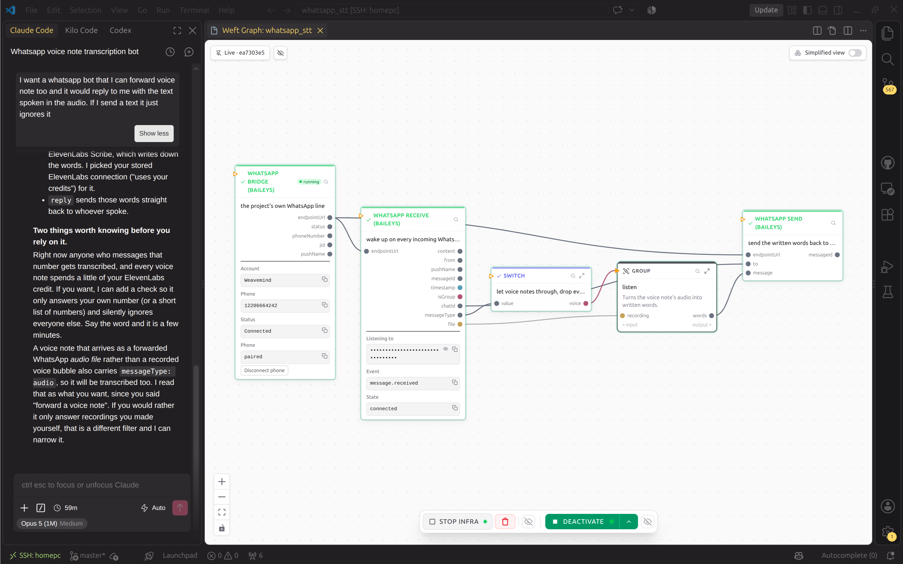

# Talking to Tangle

Tangle is the weft expert that `weft new --assistant` copied into your project.
Open the project in your assistant and it is already there. Describe what you
want in plain words and it builds it. You do not have to learn this language.

## Say what it should do, not how

> I want a WhatsApp bot I can forward voice notes to, and it replies with what
> was said in the audio. If I send it text, it just ignores it.

Tangle turns that into a graph and tells you the shape in a sentence or two
before it builds anything. Say so then if the shape is wrong.

Notice what you did not say. Not which model transcribes the audio, not how the
bot receives a message, and not how to tell a voice note from a text. That last
clause, the one about ignoring text, is a branch in the finished graph.

## What it does without being asked

**It looks things up rather than remembering.** The catalog on your disk is the
truth, and Tangle reads a step's real inputs and outputs before wiring it. The
language moves fast, so anything the model remembers is probably stale.

**It writes missing steps.** A step's own logic is Rust, and if nothing in the
catalog does what you need, Tangle designs the step's inputs and outputs and
hands it to a helper agent that writes that Rust.

**It writes the prompts.** When a model's answer decides what happens next,
Tangle hands that prompt to a helper that does nothing but write prompts,
rather than typing one out as it goes.

**It builds you a frontend.** Ask for a page, an app or a site and Tangle puts
one in `front/`, talking to your program through the program's own HTTP routes.
The default stack is SvelteKit, PostgreSQL, BetterAuth and shadcn-svelte, and
if you name a different one, yours wins.

**It tests as it goes.** Tangle runs one piece of the program on its own, with
values it makes up or a real input you gave it. It reads what came out, fixes
the step, then runs only what changed. When a case comes out right, Tangle
freezes it, and after a later change it runs that case again and reads what
moved. You do not have to be there for any of that.

**It offers guard rails on risky programs.** If strangers can post into your
program, or it sends, deletes or spends money on its own, Tangle names the
protections that slow things down (a check, a gate, a person who has to
approve) and asks you before it builds. When the program is finished, it
attacks it before handing it over.

## Give it one real case

Paste in a real input: an actual email, an actual message. Then read what came
out, and when it is wrong, say what is wrong with it rather than restating the
goal.

> This email is asking for a replacement, but the extracted request says the
> customer wants a refund. Fix the prompt for that step.

Tangle builds one stage, runs it on your case, and shows you the result before
writing the next one. For the longer version of that habit, go and read
[Sequential Diffusion Programming](../thinking/sdp.md).

## When you want to do it yourself

The `.weft` file is the source, and the graph edits that same file. For every
command, go and read [the CLI](../running/cli.md).

That is the first ten minutes. Next,
[work in the graph](../build/the-graph.md) with your own hands.
